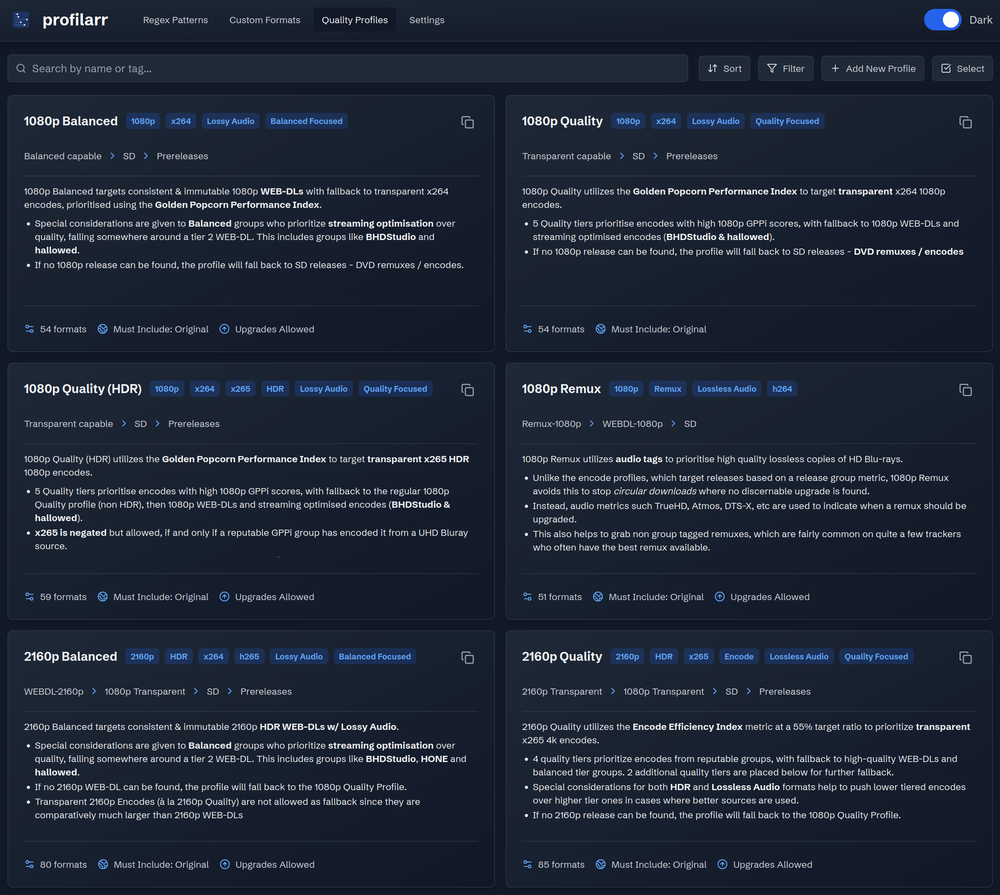

# Profilarr

[](https://github.com/Dictionarry-Hub/profilarr/releases)
[](https://hub.docker.com/r/santiagosayshey/profilarr)
[](https://github.com/Dictionarry-Hub/profilarr/blob/main/LICENSE)
[](https://dictionarry.dev/)
[](https://discord.com/invite/Y9TYP6jeYZ)
[](https://www.buymeacoffee.com/santiagosayshey)
[](https://github.com/sponsors/Dictionarry-Hub)

Configuration management tool for Radarr/Sonarr/Readarr that automates importing and version control of custom formats and quality profiles.



## Features

-   🔄 Automatic synchronization with remote configuration databases
-   🎯 Direct import to Radarr/Sonarr/Readarr instances
-   🔧 Git-based version control of your configurations
-   ⚡ Preserve local customizations during updates
-   🛠️ Built-in conflict resolution

## Getting Started

### Quick Installation (Docker Compose)

```yaml
services:
    profilarr:
        image: santiagosayshey/profilarr:latest # Use :beta for early access to new features
        container_name: profilarr
        ports:
            - 6868:6868
        volumes:
            - /path/to/your/data:/config # Replace with your actual path
        environment:
            - TZ=UTC # Set your timezone
        restart: unless-stopped
```

After deployment, access the web UI at `http://[address]:6868` to begin setup.

> **Note for Windows users:** The database is case-sensitive. Use a docker volume or the WSL file system to avoid issues:
>
> -   Docker volume example: `profilarr_data:/config`
> -   WSL filesystem example: `/home/username/docker/profilarr:/config`

### Complete Documentation

Visit our comprehensive documentation at [dictionarry.dev/wiki/profilarr-setup](https://dictionarry.dev/wiki/profilarr-setup) for detailed installation instructions and usage guides.

## Support

### Need Help?

-   **Bug Reports & Issues**: Submit technical issues via our [GitHub Issues tracker](https://github.com/Dictionarry-Hub/profilarr/issues)
-   **Community Support**: Join our [Discord community](https://discord.com/invite/Y9TYP6jeYZ) for help from developers and other users
-   **Database Issues**: Please direct database-specific issues to their respective repositories, as this repository focuses exclusively on Profilarr development

## Contributing

We welcome contributions from the community! Here's how you can help improve Profilarr:

-   **Pull Requests**: Feel free to submit PRs for bug fixes or new features
-   **Feature Suggestions**: Share your ideas through GitHub issues
-   **Documentation**: Help improve our guides and documentation
-   **Testing**: Try new features and report any issues

Detailed contributing guidelines will be available soon. Join our Discord to discuss potential contributions with the development team.

## Status

Currently in beta. Part of the [Dictionarry](https://github.com/Dictionarry-Hub) project to simplify media automation.

### Known Issues
- https://github.com/Dictionarry-Hub/profilarr/issues

### Development
- Currently focused on fixing bugs found in open beta
- 1.1 will focus on improving the 'setup' side of profilarr - adding media management / quality settings syncs

### Personal Note
Profilarr is maintained by a single CS student with no formal development experience, in their spare time. Development happens when time allows, which may affect response times for fixes and new features. The project is continuously improving, and your patience, understanding, and contributions are greatly appreciated as Profilarr grows and matures.
