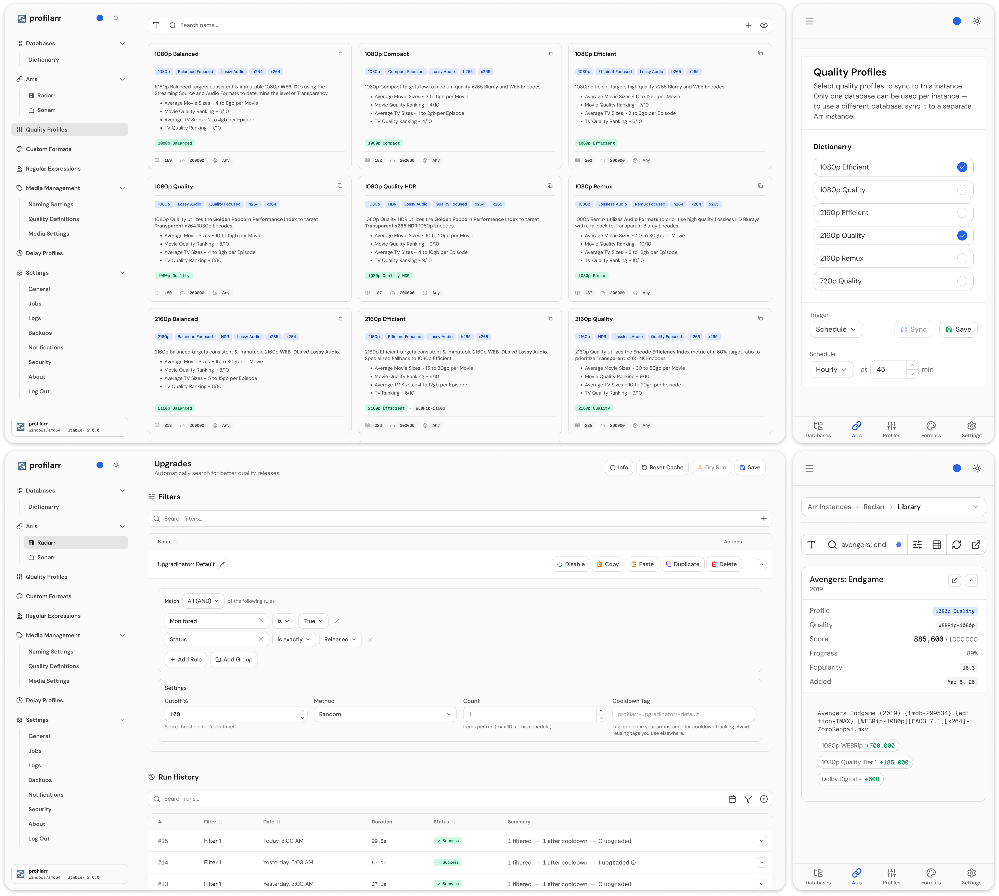

<br>

<p align="center">
  <picture>
    <source media="(prefers-color-scheme: dark)" srcset="src/lib/client/assets/banner-light.svg">
    <source media="(prefers-color-scheme: light)" srcset="src/lib/client/assets/banner-dark.svg">
    
  </picture>
</p>

<h3 align="center">An integrated development environment for Radarr and Sonarr configurations</h3>

<p align="center">
  <picture>
    <source media="(prefers-color-scheme: dark)" srcset="docs/assets/hero-dark.png">
    <source media="(prefers-color-scheme: light)" srcset="docs/assets/hero-light.png">
    
  </picture>
</p>

> [!NOTE]
> V2 is currently in closed beta. An open beta will follow, then a full release.
> Join our [Discord](https://discord.gg/2A89tXZMgA) if you'd like to beta test.
> For production use, see
> [Profilarr V1](https://github.com/Dictionarry-Hub/profilarr/tree/v1).

## Why Profilarr

Profilarr gives you a single place to build, test, and deploy configuration
across all your Radarr and Sonarr instances. No more copy-pasting settings,
cross-referencing forum posts, or hoping nothing drifts between instances.

## Features

### Build

- Custom formats with reusable regex, language filters, and resolution checks
- Quality profiles with upgrade rules and per-app CF scoring
- Media management presets (naming, media settings, quality definitions)
- Delay profiles with protocol preferences and CF score gates
- Link curated [configuration databases](https://github.com/Dictionarry-Hub/database)
  or build from scratch, with local tweaks that persist across updates

### Test

- Score releases against quality profiles with full CF match visualization
- Test release titles against custom format conditions
- Validate regex patterns with Regex101 integration

### Deploy

- Sync to any number of Radarr and Sonarr instances
- Automated upgrades with configurable filters and selectors
- Bulk rename with dry-run previews
- Scheduled jobs for sync, upgrades, renames, backups, and cleanup
- Notifications via Discord, ntfy, and webhooks

<details>
<summary>Screenshots</summary>

<!-- TODO: capture screenshots (dark + light variants via <picture>) -->
<!-- Organize by Build / Test / Deploy -->

<table>
  <tr>
    <td align="center">
      <!--  -->
      <br><b>Custom Formats</b>
    </td>
    <td align="center">
      <!--  -->
      <br><b>Quality Profiles</b>
    </td>
  </tr>
  <tr>
    <td align="center">
      <!--  -->
      <br><b>Entity Testing</b>
    </td>
    <td align="center">
      <!--  -->
      <br><b>Custom Format Testing</b>
    </td>
  </tr>
  <tr>
    <td align="center">
      <!--  -->
      <br><b>Sync</b>
    </td>
    <td align="center">
      <!--  -->
      <br><b>Jobs Dashboard</b>
    </td>
  </tr>
</table>

</details>

## Getting Started

### Production

```yaml
services:
  profilarr:
    image: ghcr.io/dictionarry-hub/profilarr:latest
    container_name: profilarr
    ports:
      - '6868:6868'
    volumes:
      - ./config:/config
    environment:
      - PUID=1000
      - PGID=1000
      - TZ=Etc/UTC
      - PARSER_HOST=parser
      - PARSER_PORT=5000
    depends_on:
      parser:
        condition: service_healthy

  # Optional - only needed for CF/QP testing
  parser:
    image: ghcr.io/dictionarry-hub/profilarr-parser:latest
    container_name: profilarr-parser
    expose:
      - '5000'
```

> [!NOTE]
> The parser service is only required for custom format and quality profile
> testing. Linking, syncing, and all other features work without it. Remove the
> `parser` service and related environment variables if you don't need it.

**Link a database**

Connect to a configuration database like the
[Dictionarry database](https://github.com/Dictionarry-Hub/database), or any
[Profilarr Compliant Database](https://github.com/Dictionarry-Hub/database-template). Browse available
profiles, custom formats, and media settings, then make local tweaks as needed.

**Add your instances and sync**

Add your Radarr and Sonarr instances by URL and API key, configure which
profiles and settings to sync, and deploy. Set up schedules to keep everything
in sync automatically.

### Development

**Prerequisites**

- [Git](https://git-scm.com/) (for PCD operations)
- [Deno](https://deno.com/) 2.x
- [.NET SDK](https://dotnet.microsoft.com/) 8.0+ (optional, for parser)

```bash
git clone https://github.com/Dictionarry-Hub/profilarr.git
cd profilarr
deno task dev
```

This runs the parser service and Vite dev server concurrently. See
[CONTRIBUTING.md](docs/CONTRIBUTING.md) for the full development workflow.

## Links

| Link | Description |
| --- | --- |
| :book: [Documentation](https://dictionarry.dev/) | Installation, usage, API reference, and configuration guides |
| :speech_balloon: [Discord](https://discord.gg/2A89tXZMgA) | Announcements, support, and community discussion |
| :hammer_and_wrench: [Contributing](docs/CONTRIBUTING.md) | Development setup, branching model, and PR process |

## Support

Every feature in Profilarr is free for everyone, and development will continue
with or without donations. If you'd like to show support, you can, but it's
in no way necessary.

- :coffee: [Buy Me A Coffee](https://www.buymeacoffee.com/santiagosayshey)
- :heart: [GitHub Sponsors](https://github.com/sponsors/Dictionarry-Hub)

## License

[AGPL-3.0](LICENSE)

Profilarr is free and open source. You do not need to pay anyone to use it. If
someone is charging you for access to Profilarr, they are violating the spirit
of this project.
