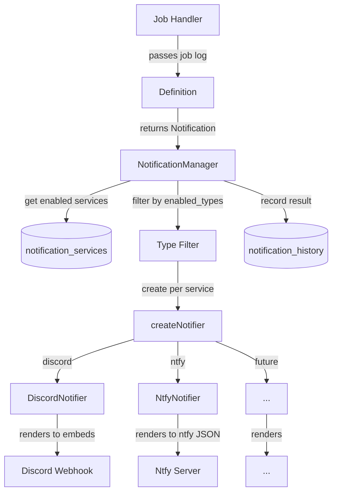

# Notification System

## Table of Contents

- [Overview](#overview)
- [Architecture](#architecture)
  - [Separation of Concerns](#separation-of-concerns)
  - [Data Flow](#data-flow)
  - [Fire-and-Forget](#fire-and-forget)
- [Notification Payload](#notification-payload)
  - [Design Rationale](#design-rationale)
  - [Severity](#severity)
  - [Blocks](#blocks)
- [Definitions](#definitions)
  - [What a Definition Does](#what-a-definition-does)
  - [What a Definition Doesn't Do](#what-a-definition-doesnt-do)
- [NotificationManager](#notificationmanager)
  - [Routing](#routing)
  - [Direct Send](#direct-send)
  - [History Recording](#history-recording)
- [Service Abstraction](#service-abstraction)
  - [Notifier Interface](#notifier-interface)
  - [BaseHttpNotifier](#basehttpnotifier)
  - [Rendering Responsibility](#rendering-responsibility)
- [Example: End-to-End Flow](#example-end-to-end-flow)
  - [1. The Event Happens](#1-the-event-happens)
  - [2. The Definition Structures It](#2-the-definition-structures-it)
  - [3. The Handler Sends It](#3-the-handler-sends-it)
  - [4. The Manager Routes It](#4-the-manager-routes-it)
  - [5. Each Notifier Renders It](#5-each-notifier-renders-it)
- [Testing](#testing)
  - [What We Test](#what-we-test)
  - [Mock Webhook Server](#mock-webhook-server)
  - [Real Webhooks](#real-webhooks)

## Overview

Profilarr's notification system sends alerts when jobs complete, databases sync,
or things go wrong. Two design goals drive every decision:

1. **Extensibility without coupling** — adding a new service (Ntfy, Slack,
   Telegram) or a new event (backup failed, PCD update available) should be a
   self-contained change that doesn't touch unrelated code.
2. **Definitions don't know about services** — the code that decides *what to
   say* about a rename never imports Discord embeds, Ntfy priorities, or Slack
   blocks. It produces a structured, service-agnostic payload. Each notifier
   decides *how to render* that payload for its platform.

Notifications are **fire-and-forget**. A failed webhook should never block a
rename, upgrade, or sync. Errors are logged and recorded in history, but never
propagated to the caller. We'd rather silently miss a notification than interrupt
a job the user cares about more.

## Architecture

### Separation of Concerns

Three layers, each with a single job:

| Layer          | Responsibility                                     | Knows about                     |
| -------------- | -------------------------------------------------- | ------------------------------- |
| **Definition** | Decides *what to say* — title, message, fields, sections, severity | Domain data (job logs, statuses) |
| **Manager**    | Decides *who to tell* — queries services, filters by type, records history | Service configs, type subscriptions |
| **Notifier**   | Decides *how to render* — maps the structured payload to a platform-specific format | Platform API (Discord embeds, Ntfy JSON, etc.) |

This means:

- Adding a new **service** never touches definitions. The notifier maps the
  existing structured payload to its platform.
- Adding a new **event** never touches notifiers. The definition produces the
  same payload shape that all notifiers already know how to render.
- The **manager** is the only routing code. No handler manually loops over
  services or instantiates notifiers.

### Data Flow



Single send path: handler calls definition, definition returns a `Notification`,
handler passes it to the manager via `send()`. The manager handles everything
from there. No bypass path, no direct notifier instantiation from handlers.

The one exception is `sendToService(serviceId, notification)` on the manager,
used for test notifications that target a specific service and bypass the
`enabled_types` filter.

### Fire-and-Forget

Every layer swallows errors:

- `BaseHttpNotifier.notify()` catches and logs, never throws
- `NotificationManager.sendToService()` wraps everything in try/catch and
  records failure in history
- Job handlers wrap the `send()` call in try/catch

This redundancy is intentional. Each layer should be independently safe. If
someone refactors the middle layer and removes error handling, the outer layers
still prevent job interruption.

## Notification Payload

```
src/lib/server/notifications/types.ts
```

```typescript
interface Notification {
  type: string;
  severity: 'success' | 'error' | 'warning' | 'info';
  title: string;
  message: string;
  blocks?: NotificationBlock[];
}

type NotificationBlock = FieldBlock | SectionBlock;

interface FieldBlock {
  kind: 'field';
  label: string;
  value: string;
  inline?: boolean;
}

interface SectionBlock {
  kind: 'section';
  title: string;
  content: string;
}
```

### Design Rationale

The payload is a **structured document**, not a rendering instruction. It
describes *what happened* with enough structure for any service to produce useful
output, but without dictating *how* it should look.

This avoids two failure modes:

1. **Too thin** — if the payload were just `{ title, message }`, services like
   Discord would get a plain text blob while being capable of rich embeds. You'd
   end up adding `discord?: DiscordEmbed[]` to the interface, coupling
   definitions to Discord.
2. **Too service-specific** — if the payload included Discord embed objects,
   every definition would import `EmbedBuilder` and every new service would have
   to either understand Discord embeds or settle for a thin fallback.

The structured payload sits in the middle. Blocks carry enough information for
Discord to build rich embeds, Ntfy to set priorities and format bodies, and a
generic webhook to forward the raw object — all from the same payload.

### Severity

`severity` replaces the old pattern of inferring colour from the type string
(`type.includes('success')` → green). It's explicit, part of the payload, and
each notifier maps it to their platform's concept:

| Notifier | success          | error           | warning          | info            |
| -------- | ---------------- | --------------- | ---------------- | --------------- |
| Discord  | Green embed      | Red embed       | Yellow embed     | Blue embed      |
| Ntfy     | Priority 3 (default) | Priority 5 (urgent) | Priority 4 (high) | Priority 3 (default) |
| Slack    | Green sidebar    | Red sidebar     | Yellow sidebar   | Blue sidebar    |
| Webhook  | Passed through as-is in JSON | | | |

### Blocks

`blocks` is a single ordered array of content. Each block is a discriminated
union (`kind` field) with two variants:

**FieldBlock** — key-value pairs for structured metadata. Stats, counts, modes.
Small, often rendered inline:

```typescript
{ kind: 'field', label: 'Files', value: '5/5', inline: true }
```

**SectionBlock** — larger content blocks. Renamed files, upgrade details, error
lists. Each has a title and a content string:

```typescript
{ kind: 'section', title: 'Breaking Bad - Season 3', content: 'Before: S03E01.mkv\nAfter: ...' }
```

The single array matters because **ordering is meaningful**. A rename
notification reads top-to-bottom:

```typescript
blocks: [
  { kind: 'field', label: 'Files', value: '5/5', inline: true },
  { kind: 'field', label: 'Folders', value: '3', inline: true },
  { kind: 'field', label: 'Mode', value: 'Live', inline: true },
  { kind: 'section', title: 'Breaking Bad - Season 3', content: 'Before: ...\nAfter: ...' },
  { kind: 'section', title: 'Breaking Bad - Season 4', content: 'Before: ...\nAfter: ...' },
  { kind: 'field', label: 'Errors', value: 'Failed to rename 1 file' },
]
```

With separate `fields[]` and `sections[]` arrays, the "Errors" field would be
forced to render with the other fields at the top, away from the content it
relates to. A single array gives definitions full control over content order
without knowing how it will be rendered.

Notifiers walk the array in order: Discord adds fields and sections to the
current embed, starting a new embed when limits are hit. Ntfy formats each block
as text lines. Generic webhooks forward the array as-is.

The union is extensible — if we ever need a third block type (image, divider,
table), we add a variant without changing the `Notification` shape or any
existing definitions.

## Definitions

```
src/lib/server/notifications/definitions/
```

### What a Definition Does

A definition takes domain data (a job log, an event payload) and returns a
`Notification` with structured content:

```typescript
export function rename(params: RenameNotificationParams): Notification {
  return {
    type: `rename.${log.status}`,
    severity: log.status === 'failed' ? 'error' : log.status === 'partial' ? 'warning' : 'success',
    title: `${prefix} Rename ${result} - ${log.instanceName}`,
    message: `Renamed ${log.results.filesRenamed} files for ${log.instanceName}`,
    blocks: [
      { kind: 'field', label: 'Files', value: `${filesRenamed}/${filesNeeding}`, inline: true },
      { kind: 'field', label: 'Mode', value: 'Live', inline: true },
      ...buildSections(log), // Grouped by item/season
    ]
  };
}
```

Definitions handle:

- Deciding the severity from the job status
- Formatting the title and summary message
- Building blocks in meaningful order (stats first, then content, then errors)
- Grouping content into sections (e.g., Sonarr files by season)

### What a Definition Doesn't Do

- Import anything from `notifiers/` — no `EmbedBuilder`, no `Colors`, no
  service-specific types
- Decide how content is rendered — no code blocks, no colour codes, no field
  truncation
- Know which services exist — the same payload goes to Discord, Ntfy, or
  anything else

## NotificationManager

```
src/lib/server/notifications/NotificationManager.ts
```

The manager is the **only** way notifications get sent. No handler instantiates a
notifier directly.

### Routing

On `notify(notification)`:

1. Query `notification_services` for all enabled services
2. Filter to services whose `enabled_types` JSON array includes the
   notification's type
3. For each matching service, `createNotifier()` builds the right notifier class
   from `service_type` + `config` JSON
4. Send in parallel via `Promise.allSettled()` (one failure doesn't block others)
5. Record success/failure in history for each service

The `createNotifier` factory is a simple switch on `service_type`:

```typescript
switch (serviceType) {
  case 'discord':
    return new DiscordNotifier(config);
  case 'ntfy':
    return new NtfyNotifier(config);
  default:
    return null;
}
```

Adding a new service means adding a case here plus the corresponding config type
import.

### Direct Send

`sendToService(serviceId, notification)` sends to a specific service, bypassing
the `enabled_types` filter. This exists for one case: test notifications from the
UI, where the user clicks "Test" on a specific service and expects it to fire
regardless of which types are enabled.

This still goes through the manager (history recording, notifier creation) — it
just skips the type filter.

### History Recording

Every send attempt is recorded in `notification_history`, regardless of success
or failure. The `finally` block in `sendToService()` ensures history is written
even if the notifier throws unexpectedly. Failed sends include the error message.

History is used for:

- Service stats in the UI (success count, failure count, success rate)
- Recent notification log (last 50)
- Debugging delivery issues

History is queryable by service, type, status, and date range. Old entries can be
pruned via `deleteOlderThan(days)`.

## Service Abstraction

### Notifier Interface

```
src/lib/server/notifications/base/Notifier.ts
```

Two methods, deliberately minimal:

```typescript
interface Notifier {
  notify(notification: Notification): Promise<void>;
  getName(): string;
}
```

`getName()` exists purely for log messages. `notify()` receives the structured
`Notification` and is responsible for rendering it into the service's native
format and sending it.

### BaseHttpNotifier

```
src/lib/server/notifications/base/BaseHttpNotifier.ts
```

Abstract base for webhook-based services. Provides:

- **Rate limiting**: 1-second minimum between sends. If a burst of notifications
  arrives (e.g., multiple arr instances finishing sync simultaneously), later ones
  are dropped with a warning log. This is crude but prevents webhook endpoint
  abuse. Discord's rate limit is 30 requests per 60 seconds per webhook — our
  1-second floor keeps us well under that.
- **Shared HTTP client**: Uses `WebhookClient` (a `BaseHttpClient` with 10s
  timeout, no retries). Connection pooling is shared across all notifications.
  No retries because webhooks should either work or not — retrying a malformed
  payload or expired URL wastes time.

Subclasses implement three methods:

| Method             | Purpose                                            |
| ------------------ | -------------------------------------------------- |
| `getWebhookUrl()`  | Return the target URL from config                  |
| `formatPayload()`  | Render `Notification` into service-specific JSON   |
| `getName()`        | Service name for logging                           |

### Rendering Responsibility

Each notifier owns the full rendering pipeline for its service. Given the
structured `Notification`, the notifier decides:

- How to map `severity` to a visual indicator (colour, priority, emoji)
- How to render each block kind (fields as embed fields or key-value lines,
  sections as code blocks or plain text)
- How to handle content that exceeds platform limits (pagination, truncation)
- What chrome to add (author lines, footers, timestamps, mentions)

This keeps all platform-specific knowledge in one place per service. The rename
definition doesn't need to know that Discord has a 6000-character embed limit or
that Ntfy supports markdown in the message body.

## Example: End-to-End Flow

A backup job completes successfully. The user has two notification services
configured: a Discord webhook and an Ntfy topic. Both subscribe to
`job.create_backup.success`. Here's what happens, layer by layer.

### 1. The Event Happens

The backup handler finishes creating a backup. It has a log object with the
filename, size, and duration:

```typescript
const log = {
  status: 'success',
  filename: 'profilarr-2026-03-17.zip',
  sizeBytes: 4_200_000,
  durationMs: 1200
};
```

### 2. The Definition Structures It

The handler calls the backup definition, which knows nothing about Discord or
Ntfy — just how to turn a backup log into a `Notification`:

```typescript
// definitions/backup.ts
export function backup(log: BackupJobLog): Notification {
  const sizeMb = (log.sizeBytes / 1_000_000).toFixed(1);
  const durationSec = (log.durationMs / 1000).toFixed(1);

  return {
    type: `job.create_backup.${log.status}`,
    severity: 'success',
    title: 'Backup Complete',
    message: `Created ${log.filename} (${sizeMb} MB)`,
    blocks: [
      { kind: 'field', label: 'Filename', value: log.filename, inline: true },
      { kind: 'field', label: 'Size', value: `${sizeMb} MB`, inline: true },
      { kind: 'field', label: 'Duration', value: `${durationSec}s`, inline: true },
    ]
  };
}
```

The output is a plain data object:

```typescript
{
  type: 'job.create_backup.success',
  severity: 'success',
  title: 'Backup Complete',
  message: 'Created profilarr-2026-03-17.zip (4.2 MB)',
  blocks: [
    { kind: 'field', label: 'Filename', value: 'profilarr-2026-03-17.zip', inline: true },
    { kind: 'field', label: 'Size', value: '4.2 MB', inline: true },
    { kind: 'field', label: 'Duration', value: '1.2s', inline: true },
  ]
}
```

### 3. The Handler Sends It

The backup handler passes the notification to the manager. One line:

```typescript
try {
  await notificationManager.notify(notifications.backup(log));
} catch {
  // fire-and-forget
}
```

The handler doesn't know or care which services are configured.

### 4. The Manager Routes It

The manager queries the database and finds two enabled services that subscribe to
`job.create_backup.success`:

| Service          | Type    |
| ---------------- | ------- |
| Main Discord     | discord |
| Phone Alerts     | ntfy    |

It creates a `DiscordNotifier` and an `NtfyNotifier` from their respective
configs, sends in parallel via `Promise.allSettled()`, and records both results
in `notification_history`.

### 5. Each Notifier Renders It

The same `Notification` object arrives at both notifiers. Each renders it for
their platform:

**Discord** builds an embed:

```json
{
  "username": "Profilarr",
  "embeds": [{
    "title": "Backup Complete",
    "color": 65280,
    "fields": [
      { "name": "Filename", "value": "profilarr-2026-03-17.zip", "inline": true },
      { "name": "Size", "value": "4.2 MB", "inline": true },
      { "name": "Duration", "value": "1.2s", "inline": true }
    ],
    "footer": { "text": "Type: job.create_backup.success" },
    "timestamp": "2026-03-17T12:00:00.000Z"
  }]
}
```

**Ntfy** builds a simple notification:

```json
{
  "topic": "profilarr",
  "title": "Backup Complete",
  "message": "Created profilarr-2026-03-17.zip (4.2 MB)\n\nFilename: profilarr-2026-03-17.zip\nSize: 4.2 MB\nDuration: 1.2s",
  "priority": 3
}
```

Same notification. Two completely different outputs. Neither notifier knows about
the other, and the definition that produced the notification knows about neither.

## Testing

```
tests/integration/notifications/
```

Notification tests import the manager and notifiers directly — no full Profilarr
server, no real jobs. A local mock HTTP server captures what each notifier sends,
and assertions run against the captured requests.

This is fast (no server boot, no job orchestration) and tests exactly the right
boundary: given a `Notification`, does the correct HTTP request come out the
other end?

### What We Test

**Manager routing:**

- Sends to services that subscribe to the notification's type
- Skips services that don't subscribe
- Skips disabled services
- `sendToService()` bypasses the type filter
- Records success in `notification_history`
- Records failure (mock returns 500) in `notification_history` with error
- One service failing doesn't block others

**Per-notifier rendering:**

- `severity` maps to the right platform concept (Discord colour, Ntfy priority)
- `blocks` render in order — fields become the service's field format, sections
  become the service's content format
- `title` and `message` appear in the expected places
- Empty `blocks` (just title + message) still produces valid output
- Large payloads that exceed platform limits get paginated/chunked correctly
  (Discord-specific)

**Error handling:**

- Unreachable URL doesn't throw (fire-and-forget)
- Timeout doesn't throw
- History records the failure with error message

### Mock Webhook Server

A `Deno.serve()` instance that captures every incoming request:

```typescript
interface CapturedRequest {
  method: string;
  path: string;
  headers: Record<string, string>;
  body: unknown;
}

const captured: CapturedRequest[] = [];

const mock = Deno.serve({ port: MOCK_PORT }, async (req) => {
  const url = new URL(req.url);
  captured.push({
    method: req.method,
    path: url.pathname,
    headers: Object.fromEntries(req.headers),
    body: await req.json()
  });
  return new Response('ok');
});
```

Tests seed `notification_services` in the database with webhook URLs pointing at
`http://localhost:${MOCK_PORT}`, then call `notificationManager.notify()` and
assert on `captured`:

```typescript
// Seed a Discord service pointing at the mock
seedService(db, {
  serviceType: 'discord',
  config: { webhook_url: `http://localhost:${MOCK_PORT}/discord` },
  enabledTypes: ['job.create_backup.success']
});

// Send a notification
await notificationManager.notify({
  type: 'job.create_backup.success',
  severity: 'success',
  title: 'Backup Complete',
  message: 'Created backup.zip (4.2 MB)',
  blocks: [
    { kind: 'field', label: 'Size', value: '4.2 MB', inline: true }
  ]
});

// Assert on what Discord received
assertEquals(captured.length, 1);
assertEquals(captured[0].path, '/discord');
assertEquals(captured[0].body.embeds[0].title, 'Backup Complete');
assertEquals(captured[0].body.embeds[0].color, 65280); // green
assertEquals(captured[0].body.embeds[0].fields[0].name, 'Size');
```

The mock can also be configured to return errors for failure-path testing:

```typescript
const mock = Deno.serve({ port: MOCK_PORT }, () => {
  return new Response('Internal Server Error', { status: 500 });
});

await notificationManager.notify(notification);

// History should record the failure
const history = notificationHistoryQueries.getRecent(1);
assertEquals(history[0].status, 'failed');
```

### Real Webhooks

For manual verification during development — "I just wrote the Ntfy notifier and
want to see it on my phone." An optional env file with real endpoints:

```
tests/integration/notifications/.env.test    ← gitignored
```

```env
TEST_DISCORD_WEBHOOK=https://discord.com/api/webhooks/...
TEST_NTFY_URL=https://ntfy.sh
TEST_NTFY_TOPIC=profilarr-test
TEST_NTFY_TOKEN=tk_...
```

Tests check for the var and skip if absent:

```typescript
const webhook = Deno.env.get('TEST_DISCORD_WEBHOOK');
if (!webhook) {
  skip('TEST_DISCORD_WEBHOOK not set — skipping real webhook test');
  return;
}

const notifier = new DiscordNotifier({ webhook_url: webhook });
await notifier.notify(notification);
// No assertion — just check your phone / Discord channel
```

These never run in CI. They exist so you can manually verify rendering looks
right on the actual platform after writing a new notifier.
