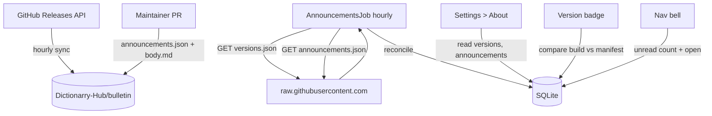

# Announcements

## Table of Contents

- [Overview](#overview)
- [Architecture](#architecture)
  - [Why direct to the CDN](#why-direct-to-the-cdn)
- [Bulletin Repo](#bulletin-repo)
  - [Layout](#layout)
  - [versions.json](#versionsjson)
  - [announcements.json](#announcementsjson)
- [Fetch & Cache](#fetch--cache)
- [Version Check](#version-check)
  - [Build Stamping](#build-stamping)
  - [Channels](#channels)
  - [Development](#development)
- [About Page Consolidation](#about-page-consolidation)
- [Read Tracking](#read-tracking)
- [Publishing an Announcement](#publishing-an-announcement)
- [Database Announcements (TBD)](#database-announcements-tbd)

## Overview

The announcements system delivers two kinds of signals to every running
Profilarr instance:

1. **Announcements**: free-form messages from the Profilarr team (breaking
   changes, deprecations, feature spotlights). Authored as markdown, identified
   by ULID, read-tracked per user.
2. **Version check**: a derived "you are out of date" signal, computed by
   comparing the running build's channel and version to the channel's current
   value in the manifest.

Both are served from a standalone repo, `Dictionarry-Hub/bulletin`, as two
separate files:

- `versions.json` - bot-owned, rebuilt hourly from the GitHub Releases API.
- `announcements.json` - human-owned, edited via PR.

Separate files keep the failure domains independent: a bad announcement PR
can't break the version check, and the sync bot can't stomp on an in-flight
announcement PR.

Everything is fetched over `raw.githubusercontent.com` (CDN, no API rate
limit). A separate repo (rather than a branch or folder in `profilarr`) means
announcements publish without cutting a Profilarr release.

## Architecture



All Profilarr-to-bulletin traffic is read-only against a public CDN. No auth,
no proxy, no GitHub API quota from Profilarr instances (the API is only used
by bulletin's own scheduled workflow).

### Why direct to the CDN

A maintainer-run proxy would dodge GitHub's API rate limit, but it would also
hand us every instance's IP, version, and poll cadence as a side effect.
`raw.githubusercontent.com` is a CDN with no such limit, so there's no
reliability argument for the proxy and no reason to introduce phone-home
telemetry that wasn't asked for.

## Bulletin Repo

### Layout

```
bulletin/
├── versions.json                   # bot-owned
├── announcements.json              # human-owned via PR
├── announcements/
│   └── <ulid>.md                   # body for each announcement
├── schema/
│   ├── versions.schema.json
│   └── announcements.schema.json
└── .github/
    └── workflows/
        ├── validate.yml            # PR validation
        └── sync.yml                # hourly versions.json sync
```

### versions.json

```json
{
	"schema": 1,
	"updated_at": "2026-04-20T10:00:00Z",
	"channels": {
		"stable": {
			"latest": "2.3.0",
			"releases": [
				{
					"tag": "2.3.0",
					"published_at": "2026-04-15T12:00:00Z",
					"url": "https://github.com/Dictionarry-Hub/profilarr/releases/tag/v2.3.0"
				},
				{
					"tag": "2.2.1",
					"published_at": "2026-03-02T09:00:00Z",
					"url": "https://github.com/Dictionarry-Hub/profilarr/releases/tag/v2.2.1"
				}
			]
		},
		"develop": {
			"latest": "abc1234",
			"published_at": "2026-04-20T10:00:00Z"
		}
	}
}
```

Rebuilt hourly by `sync.yml`:

1. Paginate `GET /repos/Dictionarry-Hub/profilarr/releases`, filter drafts and
   prereleases, sort by `published_at` descending.
2. `GET /repos/Dictionarry-Hub/profilarr/commits/develop` for the develop
   pointer.
3. Overwrite `channels` in-place. If the resulting file differs from the
   previous commit, bump `updated_at` and push.

Full overwrite (not append) means yanked releases disappear, edited metadata
propagates, and the manifest can't drift from GitHub's source of truth.

### announcements.json

```json
{
	"schema": 1,
	"updated_at": "2026-04-20T10:00:00Z",
	"announcements": [
		{
			"id": "01HXYZ...",
			"title": "API v1 migration landing in 2.4",
			"severity": "warning",
			"published_at": "2026-04-10T10:00:00Z",
			"expires_at": null,
			"min_version": "2.0.0",
			"max_version": null,
			"link": "https://github.com/Dictionarry-Hub/profilarr/discussions/..."
		}
	]
}
```

| Field                         | Notes                                                          |
| ----------------------------- | -------------------------------------------------------------- |
| `id`                          | ULID (26 chars, Crockford Base32). Immutable once published.   |
| `severity`                    | `info`, `warning`, `critical`.                                 |
| `published_at`                | Drives sort order and "new since last visit" state.            |
| `expires_at`                  | Optional. After this, the client hides the entry.              |
| `min_version` / `max_version` | Optional SemVer bounds. Absent or null = no bound on that end. |
| `link`                        | Optional external URL surfaced as "Read more".                 |

Bodies live in `announcements/<id>.md` and are fetched the first time a user
opens an announcement, not during the manifest poll.

## Fetch & Cache

An hourly job (plus one run at startup) fetches both files:

- **Success on `versions.json`**: update the in-memory/DB snapshot used by the
  version badge and About page.
- **Success on `announcements.json`**: reconcile against the `announcements`
  table (insert new ids, update mutable fields, mark missing ids as
  `withdrawn`).
- **Failure on either**: log, keep the last-known cache for that file, and
  keep going with the other. The UI never hard-errors if GitHub is
  unreachable.
- **Body fetch**: on first open, populate `announcements.body`. Subsequent
  opens hit the cached row.

The env var `PROFILARR_BULLETIN_URL` overrides the base URL (default
`https://raw.githubusercontent.com/Dictionarry-Hub/bulletin/main`) for
testing against a fork, branch, or local file server.

## Version Check

The client compares its own baked-in `{version, channel}` against
`channels[channel].latest` from `versions.json`.

### Build Stamping

The running build's identity lives in a single module emitted at build time:

```
src/lib/shared/build.ts
```

```ts
export const build = {
	version: '2.3.0',
	channel: 'stable', // 'stable' | 'develop' | 'dev'
	commit: 'abc1234'
} as const;
```

The `Dockerfile` takes build args and writes this file before the Svelte
build so both server and client import the same values:

```
ARG PROFILARR_VERSION
ARG PROFILARR_CHANNEL
ARG PROFILARR_COMMIT
```

`deno task dev` uses a committed fallback (`version: 'dev'`, `channel: 'dev'`,
`commit: null`). The file is gitignored so dev and CI don't fight over it.

**Replaces `app_info.version`.** Today the version lives in the `app_info`
table (migration 018, `src/lib/server/db/queries/appInfo.ts`) and is read in
four places:

- `src/routes/+layout.server.ts:24`
- `src/routes/api/v1/status/+server.ts:27`
- `src/lib/server/utils/logger/startup.ts:55` (banner)
- `src/lib/server/utils/logger/startup.ts:73` (`getServerInfo`)

The stored value is stuck at `'2.0.0'` because no migration ever bumps it, so
it's effectively dead data. All four call sites switch to `build.version`, a
new migration drops the `app_info` table, and `queries/appInfo.ts` is
deleted as part of this PR.

### Channels

| Channel   | Build trigger             | Version stamp                         | Comparison                |
| --------- | ------------------------- | ------------------------------------- | ------------------------- |
| `stable`  | Tag `v*.*.*` on `develop` | `package.json` version (e.g. `2.3.0`) | `channels.stable.latest`  |
| `develop` | Push to `develop`         | Short commit SHA                      | `channels.develop.latest` |
| `dev`     | `deno task dev`           | Literal `dev`                         | Skipped                   |

"Out of date" is treated as derived state, not an announcement. It has its own
footer badge, not an entry in the inbox, because it clears itself once the
user upgrades.

There is no CI job in the `profilarr` repo that touches the bulletin repo.
The bulletin repo self-syncs hourly from the GitHub Releases API. Tag-to-
manifest latency is up to one hour; since Profilarr clients also poll hourly,
this is invisible in practice.

### Development

`deno task dev` uses channel `dev` and skips the version comparison entirely.
Maintainers never see a false "out of date" badge while working against
feature branches.

Announcement **fetching still runs** in dev so the feature is exercisable. Set
`PROFILARR_BULLETIN_URL` to a fork or local file server to test new
announcement payloads end-to-end without touching the production bulletin.

## About Page Consolidation

The existing **Settings > About** page (`src/routes/settings/about/`) currently
has two overlapping surfaces:

- A **Version** row with a live badge, powered by `packageJson.version` and a
  streamed fetch through `getCachedReleases('Dictionarry-Hub', 'profilarr')`
  that hits the GitHub Releases API and caches into `github_cache`.
- A **Releases** `ExpandableTable` showing the latest stable collapsed and up
  to 10 recent releases expanded, fed by the same cached fetch.

Both move to the bulletin-sourced data:

- Version row reads `build.version` + compares against
  `channels[build.channel].latest` from the cached `versions.json`.
- Releases table reads `channels.stable.releases` directly.

That removes the only caller of `getCachedReleases`, so the function is
deleted. The `github_cache` table stays (still used for avatars and repo
info by other callers).

## Read Tracking

Read state lives inline on the `announcements` row as a nullable `read_at`
DATETIME column. Profilarr is single-user in practice, so a separate
per-user table would just be dead structure. If we ever need multi-user
later, we migrate `read_at` into a new `announcements_read(user_id, ...)`
table and drop the column.

```sql
CREATE TABLE announcements (
  id TEXT PRIMARY KEY,
  title TEXT NOT NULL,
  severity TEXT NOT NULL CHECK (severity IN ('info','warning','critical')),
  published_at DATETIME NOT NULL,
  expires_at DATETIME,
  min_version TEXT,
  max_version TEXT,
  link TEXT,
  body TEXT,                              -- null until first lazy fetch
  withdrawn INTEGER NOT NULL DEFAULT 0,
  read_at DATETIME,                       -- null = unread
  fetched_at DATETIME NOT NULL,
  body_fetched_at DATETIME
);

CREATE TABLE versions_snapshot (
  id INTEGER PRIMARY KEY CHECK (id = 1),
  payload TEXT NOT NULL,                  -- latest versions.json as-fetched
  fetched_at DATETIME NOT NULL
);
```

`versions_snapshot` is a singleton cache of the last successful
`versions.json` fetch. The About page and footer badge read from it so the
UI stays responsive without re-fetching.

### Schema-version rejection

If a bulletin payload arrives with `schema !== 1`, the reconcile aborts and
logs a warning. The existing snapshot is preserved. This gives us a clean
escape hatch when we eventually need to evolve the bulletin format.

### Announcement cap

The reconciler caps ingestion at 1000 entries per payload. Overflow is
logged and ignored. Prevents a misbehaving bulletin from writing unbounded
rows.

### Dev-channel bypass

When `build.channel === 'dev'` or the running version contains a `-`
prerelease suffix, version bounds on announcements are ignored (dev always
sees everything). Expiry and withdrawn state still apply.

## Publishing an Announcement

1. Generate a ULID.
2. Write `announcements/<id>.md` (body; markdown supported).
3. Add the entry to `announcements.json`'s `announcements` array with
   metadata.
4. Open a PR against `bulletin`. CI validates schema, ULID uniqueness, and
   that every announcement has a matching body file (and vice versa).

Instances pick it up on the next fetch (hourly) or next restart.

## Database Announcements (TBD)

Same model, scoped to a specific PCD: each PCD repo ships an
`announcements/` folder and a section in its `pcd.json` manifest. Picked up
during normal PCD sync, visible only to users who have that database linked.

Out of scope for the initial PR and tracked under
[#291](https://github.com/Dictionarry-Hub/profilarr/issues/291). Notes for when
we get there:

- Scope rule: show to users with the database **linked** (not just browsed).
- Reuse the same `announcements` + `announcements_read` tables with a
  `source` column (`profilarr` | `pcd:<id>`).
- No new polling job: piggybacks on PCD sync, so there's no GitHub traffic
  outside an active database connection.
