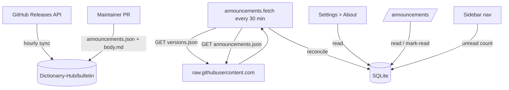

# Announcements

## Table of Contents

- [Overview](#overview)
- [Architecture](#architecture)
  - [Why direct to the CDN](#why-direct-to-the-cdn)
- [Bulletin Repo](#bulletin-repo)
  - [Layout](#layout)
  - [versions.json](#versionsjson)
  - [announcements.json](#announcementsjson)
- [Fetch & Cache](#fetch--cache)
- [Version Check](#version-check)
  - [Build Stamping](#build-stamping)
  - [Channels](#channels)
  - [Development](#development)
- [Database Schema](#database-schema)
- [Publishing an Announcement](#publishing-an-announcement)
- [Testing Locally](#testing-locally)
- [Database Announcements](#database-announcements)

## Overview

Profilarr delivers two kinds of signals to every running instance:

1. **Announcements**: free-form messages from the Profilarr team. Markdown
   bodies, identified by ULID, read-tracked.
2. **Version check**: a derived "you are out of date" signal computed from
   the running build's channel and version against the latest values in the
   manifest.

Both live in the standalone `Dictionarry-Hub/bulletin` repo as two files:

- `versions.json` — bot-owned, rebuilt hourly from the GitHub Releases API.
- `announcements.json` — human-owned, edited via PR.

Separate files keep the failure domains independent: a bad announcement PR
can't break the version check, and the sync bot can't stomp on an in-flight
announcement PR. Keeping them in a separate repo (rather than a branch in
`profilarr`) means announcements publish without cutting a Profilarr
release.

Everything is fetched over `raw.githubusercontent.com`.

## Architecture



All Profilarr-to-bulletin traffic is read-only against a public CDN. No
auth, no proxy, no GitHub API quota from Profilarr instances. The API is
only called by the bulletin repo's own scheduled sync workflow.

### Why direct to the CDN

A maintainer-run proxy would dodge GitHub's API rate limit, but it would
also hand us every instance's IP, version, and poll cadence as a side
effect. `raw.githubusercontent.com` is a CDN with no such limit, so there's
no reliability argument for the proxy and no reason to introduce phone-home
telemetry that wasn't asked for.

## Bulletin Repo

### Layout

```
bulletin/
├── versions.json                   # bot-owned
├── announcements.json              # human-owned via PR
├── announcements/
│   └── <ulid>.md                   # body for each announcement
├── schema/
│   ├── versions.schema.json
│   └── announcements.schema.json
└── .github/
    └── workflows/
        ├── validate.yml            # PR validation
        └── sync.yml                # hourly versions.json sync
```

### versions.json

```json
{
	"schema": 1,
	"updated_at": "2026-04-20T10:00:00Z",
	"channels": {
		"stable": {
			"latest": "2.3.0",
			"releases": [
				{
					"tag": "2.3.0",
					"published_at": "2026-04-15T12:00:00Z",
					"url": "https://github.com/Dictionarry-Hub/profilarr/releases/tag/v2.3.0"
				}
			]
		},
		"develop": {
			"latest": "abc1234",
			"published_at": "2026-04-20T10:00:00Z"
		}
	}
}
```

Rebuilt hourly by `sync.yml`:

1. Paginate `GET /repos/Dictionarry-Hub/profilarr/releases`, filter drafts
   and prereleases, sort by `published_at` descending.
2. `GET /repos/Dictionarry-Hub/profilarr/commits/develop` for the develop
   pointer.
3. Overwrite `channels` in-place. If the resulting file differs from the
   previous commit, bump `updated_at` and push.

Full overwrite (not append) means yanked releases disappear, edited metadata
propagates, and the manifest can't drift from GitHub's source of truth.

### announcements.json

```json
{
	"schema": 1,
	"updated_at": "2026-04-20T10:00:00Z",
	"announcements": [
		{
			"id": "01HXYZ...",
			"title": "API v1 migration landing in 2.4",
			"severity": "warning",
			"published_at": "2026-04-10T10:00:00Z",
			"expires_at": null,
			"min_version": "2.0.0",
			"max_version": null,
			"link": "https://github.com/Dictionarry-Hub/profilarr/discussions/..."
		}
	]
}
```

| Field                         | Notes                                                          |
| ----------------------------- | -------------------------------------------------------------- |
| `id`                          | ULID (26 chars, Crockford Base32). Immutable once published.   |
| `severity`                    | `info`, `warning`, `critical`.                                 |
| `published_at`                | Drives sort order in the inbox.                                |
| `expires_at`                  | Optional. After this, the client hides the entry.              |
| `min_version` / `max_version` | Optional SemVer bounds. Absent or null = no bound on that end. |
| `link`                        | Optional external URL surfaced as "Read more".                 |

Bodies live in `announcements/<id>.md` and are fetched the first time an
announcement is opened, then cached in SQLite.

## Fetch & Cache

The `announcements.fetch` job runs every 30 minutes (plus once at startup):

- **Success on `versions.json`**: overwrite the `versions_snapshot`
  singleton row used by the About page and the nav.
- **Success on `announcements.json`**: reconcile against the
  `announcements` table (insert new ids, update mutable fields, mark
  missing ids as `withdrawn`, unwithdraw ids that reappear).
- **Failure on either**: log, keep the last-known cache for that file,
  continue with the other. The UI never hard-errors if GitHub is
  unreachable.
- **Body fetch**: populated on first open via
  `service.getDetail(id, { loadBody: true })`, cached in
  `announcements.body` afterwards.

`PROFILARR_BULLETIN_URL` overrides the base URL (default
`https://raw.githubusercontent.com/Dictionarry-Hub/bulletin/main`) for
testing against a fork, branch, or local file server. `deno task
dev:bulletin` serves `scripts/dev-bulletin/` fixtures on port 6970 for
local development.

A bulletin payload with `schema !== 1` is rejected with a warning and the
existing snapshot is preserved. Announcement payloads are also capped at
1000 entries per fetch; overflow is logged and ignored.

## Version Check

The client compares its own baked-in `{version, channel}` against
`channels[channel].latest` from the last `versions.json` snapshot.

### Build Stamping

The running build's identity lives in a single module:

```
src/lib/shared/build.ts
```

```ts
export const build: BuildInfo = {
	version: '2.3.0',
	channel: 'stable',
	commit: 'abc1234'
};
```

Committed to git with dev-fallback values (`version: 'dev'`,
`channel: 'dev'`, `commit: null`). The `Dockerfile` takes three build
args and overwrites the file before `vite build` runs, so both server
and client bundles see the stamped values:

```
ARG PROFILARR_VERSION
ARG VITE_CHANNEL
ARG PROFILARR_COMMIT
```

`.github/workflows/release.yml` populates these from the git ref: tag
`v*.*.*` → stable + `package.json` version, push to `develop` → develop

- short SHA.

`build.version` is the single source of version truth across the
codebase: `+layout.server.ts`, `/api/v1/status`, the startup banner, and
the About page all read from it.

### Channels

| Channel   | Build trigger             | Version stamp                         | Comparison                |
| --------- | ------------------------- | ------------------------------------- | ------------------------- |
| `stable`  | Tag `v*.*.*` on `develop` | `package.json` version (e.g. `2.3.0`) | `channels.stable.latest`  |
| `develop` | Push to `develop`         | Short commit SHA                      | `channels.develop.latest` |
| `dev`     | `deno task dev`           | Literal `dev`                         | Skipped                   |

Version-out-of-date is derived state, not an announcement. It renders as
a status pill next to the build info on the About page; it clears itself
once the user upgrades.

Tag-to-manifest latency is up to one hour (bulletin re-syncs hourly);
Profilarr clients poll every 30 minutes, so in the worst case a fresh
tag surfaces ~90 minutes later. No CI job in the `profilarr` repo touches
the bulletin repo directly.

### Development

`deno task dev` uses channel `dev` and skips the version comparison
entirely. Announcement fetching still runs so the feature is testable;
point `PROFILARR_BULLETIN_URL` at `deno task dev:bulletin` (port 6970)
or any fork / local server to exercise new payloads without touching the
production bulletin.

Version bounds on announcements are ignored when `channel === 'dev'` or
the running version contains a `-` prerelease suffix (dev always sees
everything). Expiry and withdrawn state still apply.

## Database Schema

```sql
CREATE TABLE announcements (
  id TEXT PRIMARY KEY,
  title TEXT NOT NULL,
  severity TEXT NOT NULL CHECK (severity IN ('info','warning','critical')),
  published_at DATETIME NOT NULL,
  expires_at DATETIME,
  min_version TEXT,
  max_version TEXT,
  link TEXT,
  body TEXT,                              -- null until first open
  withdrawn INTEGER NOT NULL DEFAULT 0,
  read_at DATETIME,                       -- null = unread
  fetched_at DATETIME NOT NULL,
  body_fetched_at DATETIME
);

CREATE TABLE versions_snapshot (
  id INTEGER PRIMARY KEY CHECK (id = 1),
  payload TEXT NOT NULL,                  -- latest versions.json as-fetched
  fetched_at DATETIME NOT NULL
);
```

Read state lives inline on the `announcements` row as a nullable
`read_at` DATETIME. Profilarr is single-user in practice, so a separate
per-user table isn't needed.

`versions_snapshot` is a singleton that caches the last successful
`versions.json` fetch. The About page and nav read from it so page loads
don't re-fetch.

## Publishing an Announcement

1. Generate a ULID.
2. Write `announcements/<id>.md` (body; markdown supported).
3. Add the entry to `announcements.json`'s `announcements` array with
   metadata.
4. Open a PR against `bulletin`. CI validates schema, ULID uniqueness,
   and that every announcement has a matching body file (and vice versa).

Instances pick it up on the next fetch (every 30 minutes) or on restart.

## Testing Locally

Point dev at fixture files instead of the live bulletin:

```bash
# Terminal 1
deno task dev:bulletin

# Terminal 2
PROFILARR_BULLETIN_URL=http://localhost:6970 deno task dev
```

To preview the sidebar and About-page under a different channel, hand-edit
`src/lib/shared/build.ts` and refresh. Do not commit — the Dockerfile
overwrites this file on every image build.

```ts
// stable, up to date against the live bulletin
export const build: BuildInfo = { version: '1.1.4', channel: 'stable', commit: 'abc1234' };

// develop
export const build: BuildInfo = {
	version: '<short-sha>',
	channel: 'develop',
	commit: '<short-sha>'
};
```

## Database Announcements

Per-PCD announcements live in each linked database's working copy as
single-file markdown documents: `${pcdPath}/announcements/<ulid>.md`,
YAML frontmatter on top, body below. There is no JSON manifest. One
file = one announcement. Adding, editing, or withdrawing means touching
exactly one file, which keeps maintainer diffs aligned with intent.

The pipeline mirrors the bulletin: pull, parse, reconcile, fire
`announcement.new` per net-new entry. The only differences are the
source (working copy on disk, not the bulletin CDN), the storage table
(`database_announcements`, scoped per database), and the trigger (the
`pcd.sync` job and the manual `/databases/[id]/changes` pull, not a
30-minute timer).

### File Format

```yaml
---
title: Migration to v2
severity: warning # info | warning | critical
published_at: 2026-04-20T10:00:00Z
expires_at: 2026-05-20T10:00:00Z # optional
link: https://example.com/migration # optional
---
Markdown body here.
```

The id is the filename minus `.md`. ULIDs are used so `ls` sorts
chronologically. There is no `min_version` / `max_version`; PCD
announcements do not gate by Profilarr version.

The parser tolerates malformed files: each is reported as a `ParseError`
and skipped. One bad file never blocks a reconcile.

### Storage

Migration `063_create_database_announcements.ts` adds the table:

```sql
CREATE TABLE database_announcements (
  id TEXT NOT NULL,
  database_id INTEGER NOT NULL,
  title TEXT NOT NULL,
  severity TEXT NOT NULL CHECK (severity IN ('info','warning','critical')),
  published_at DATETIME NOT NULL,
  expires_at DATETIME,
  link TEXT,
  body TEXT NOT NULL,         -- snapshotted at reconcile time
  withdrawn INTEGER NOT NULL DEFAULT 0,
  read_at DATETIME,
  fetched_at DATETIME NOT NULL,
  PRIMARY KEY (id, database_id),
  FOREIGN KEY (database_id) REFERENCES database_instances(id) ON DELETE CASCADE
);
```

Composite PK `(id, database_id)` so the same ULID could appear under two
PCDs without collision. `ON DELETE CASCADE` wipes the rows when a user
unlinks a database. Body is `NOT NULL` because the working copy is on
disk during reconcile, so we snapshot the body alongside the metadata
(no lazy fetch like the bulletin path needs).

### Reconcile

`reconcileFromWorkingCopy(databaseId)` in
`src/lib/server/announcements/database/service.ts`:

1. Look up the database row (uuid, name).
2. Resolve `pcdPath` via `getPCDPath(uuid)`.
3. Parse every `announcements/*.md`, collecting parse errors.
4. Compare the parsed list against existing rows for this `database_id`
   only (the `WHERE database_id = ?` filter is the structural defense
   against cross-source data loss).
5. Apply the plan in a single transaction: upsert the parsed entries,
   mark missing-from-disk ids as withdrawn, mark reappearing withdrawn
   ids as unwithdrawn.
6. Return `newlyInserted` so the caller can fire notifications.

The generic reconcile algorithm (`shared/reconcile.ts`) is the same one
the bulletin uses; the database service is just a thin wrapper that
adds working-copy I/O and the source-scoped queries.

#### First-sync silent path

When a user newly links a PCD that already has historical announcements,
firing one `announcement.new` per entry would be hostile. The caller
passes `isFirstSync` to `reconcileFromWorkingCopy`, derived from
`instance.last_synced_at === null` and captured _before_ any code path
that updates `last_synced_at`. When true, every insert during this pass
is stamped with `read_at = NOW()` and `newlyInserted` is returned empty
so no notifications fire. Subsequent reconciles pass `isFirstSync: false`
and behave normally.

Detection is deliberately driven by the explicit parameter, not by "no
rows yet for this database". A row-count fallback would silence the
maintainer's first-ever announcement on a long-linked PCD that simply
hadn't had any announcements before, which is the opposite of what we
want.

### Notification

The bulletin and per-PCD paths share one notification type:
`announcement.new`. The `definitions/announcement.ts` function takes an
optional `source` parameter:

```ts
{ kind: 'profilarr' }                          // default
{ kind: 'pcd', databaseName: 'Library DB' }    // per-PCD
```

When `kind === 'pcd'`, the title is prefixed with the database name and
a `From` field block is added. Severity mapping and notifier output are
unchanged. One subscription toggle covers both sources.

### Triggers

`reconcileAndNotify(databaseId, ctx)` is the entry point. It is called
from every path that has just brought a working copy up to date:

- The `pcd.sync` job handler, on every successful path (after pull,
  after notify-only, and after no-updates so local maintainer edits get
  picked up).
- The manual `/databases/[id]/changes` pull form action, after a
  successful `pcdManager.sync()`.

Authoring (see below) calls the lower-level `reconcileFromWorkingCopy`
directly without the notification step, since the maintainer just
created the announcement themselves.

Failures in the reconcile-and-notify pipeline are logged and swallowed.
A broken announcement file must never fail the parent sync.

### Maintainer Authoring

Each database with a personal access token gets an "Announcements" tab
under `/databases/[id]/announcements`. Three routes:

- `/`: list view, parses the working copy on load, links to new + edit.
- `/new`: form. Generates a fresh ULID on save and writes
  `announcements/<ulid>.md` atomically (temp + rename).
- `/[ulid]`: edit form. Save overwrites the file; Withdraw deletes it.

The flow mirrors the readme + manifest editing pattern at
`/databases/[id]/config`: dirty store for in-browser draft state, form
POST to a server action that writes the file, no DB writes from the
authoring UI itself. After every save / delete the action invokes
`reconcileFromWorkingCopy(id)` so the maintainer sees their change in
the inbox immediately. Notifications are deliberately suppressed for
the authoring path: the maintainer just wrote this themselves.

Files are written, not committed. The maintainer commits and pushes
through the existing PCD git flow.

### Inbox UNION

`/announcements` UNIONs both sources via
`src/lib/server/announcements/inbox.ts`. Each row carries a `source`
discriminator (`profilarr` | `pcd`) plus the database name when source
is `pcd`. The page renders a Source column with an icon per source and
a filter chip when at least one PCD has announcements. The nav unread
badge counts both sources via `inbox.getUnreadCount()`.

Mark-read / mark-unread actions take `source` and (for `pcd`)
`databaseId` as form fields and dispatch to the correct subsystem.
