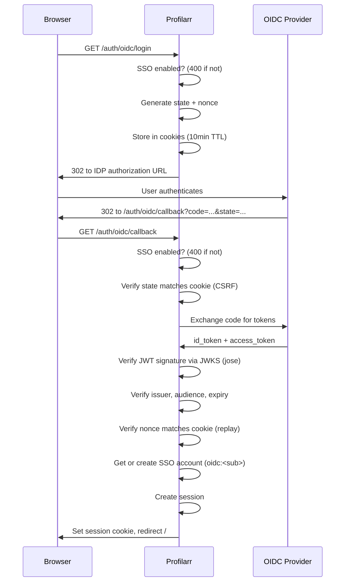
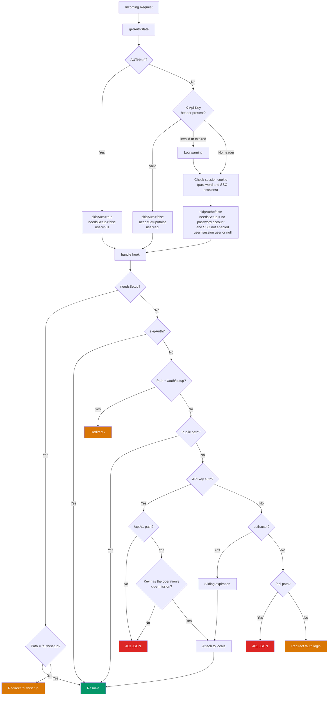

# Auth System

## Table of Contents

- [Overview](#overview)
- [Auth Modes](#auth-modes)
  - [AUTH=on](#authon-default)
  - [SSO (OIDC)](#sso-oidc)
  - [AUTH=off](#authoff)
  - [Accounts](#accounts)
  - [Login Scenarios](#login-scenarios)
  - [API Keys](#api-keys)
    - [Permissions](#permissions)
- [Request Flow](#request-flow)
- [Security Features](#security-features)
  - [Hashing](#hashing)
  - [Rate Limiting](#rate-limiting)
  - [CSRF & Reverse Proxies](#csrf--reverse-proxies)
  - [Protected Paths](#protected-paths)
  - [Secret Stripping](#secret-stripping)
  - [XSS via Markdown / {@html}](#xss-via-markdown--html)
  - [Path Traversal](#path-traversal)
- [Test Coverage](#test-coverage)
  - [Unit Tests](#unit-tests-srctestsauth)
  - [Integration Tests](#integration-tests-srctestsintegrationspecs)
  - [E2E Tests](#e2e-tests-srctestse2especsauth)
  - [Security Scans](#security-scans)
    - [SAST - Semgrep](#sast--semgrep)
    - [Container Scanning - Trivy](#container-scanning--trivy)
    - [DAST - OWASP ZAP](#dast--owasp-zap)
  - [Infrastructure](#infrastructure)

## Overview

### Why security matters

Profilarr stores credentials for connected services: arr API keys, GitHub PATs,
AI API keys, TMDB keys, and notification webhooks.

The arr keys are the biggest risk. Sonarr/Radarr store indexer and tracker API
keys internally - exposing an arr API key gives access to the arr's full API,
which can retrieve all configured indexer credentials.

Ideally Profilarr never touches the open internet. Users should be connecting
via a VPN, Tailscale, or sitting behind an authenticating reverse proxy. The
built-in auth exists as a safety net - if someone does expose it, they're not
immediately wide open. As Seraphys (Dictionarry's Database Maintainer) likes to
say - It's _stupidity mitigation_. Patent Pending.

### Defence in depth

1. **Authentication** - gate access via username/password, OIDC, or API key.
   Enforced by `getAuthState()` in middleware and `handle()` in the server hook.
2. **Data exposure controls** - authenticated users never see raw secrets. The
   frontend receives boolean flags (`hasApiKey`, `hasPat`) instead of actual
   values. Secrets are also stripped from backup downloads.
3. **Filesystem is the trust boundary** - encrypting secrets at rest would be
   theatre since the decryption key would also be on disk. Filesystem security
   (containers, unprivileged users, volume permissions) is the user's
   responsibility.

## Auth Modes

`AUTH` turns login on or off. SSO through OIDC is an add-on to `AUTH=on`: it is
enabled by setting all three `OIDC_*` settings. When login is on, API keys also
work through the `X-Api-Key` header.

| Variable             | Default | Description                                                   | Example                                                      |
| -------------------- | ------- | ------------------------------------------------------------- | ------------------------------------------------------------ |
| `AUTH`               | `on`    | Login: `on` or `off`. `oidc` is a deprecated alias for `on`   | `on`                                                         |
| `ORIGIN`             | -       | Scheme + host for reverse proxy (CSRF, cookies, OIDC)         | `https://profilarr.mydomain.com`                             |
| `OIDC_DISCOVERY_URL` | -       | OIDC provider discovery endpoint. Set all three to enable SSO | `https://auth.mydomain.com/.well-known/openid-configuration` |
| `OIDC_CLIENT_ID`     | -       | OIDC client ID. Set all three to enable SSO                   | `profilarr`                                                  |
| `OIDC_CLIENT_SECRET` | -       | OIDC client secret. Set all three to enable SSO               | `your-secret`                                                |

The settings are parsed at startup by `parseAuthConfig()` in
`src/lib/server/utils/config/auth.ts`. Profilarr refuses to start, with an
error log line naming the problem, when:

- some but not all of the `OIDC_*` settings are set (unless `AUTH=off`), so a
  typo can't silently turn SSO off and open first-run setup
- `AUTH=oidc` is set without any `OIDC_*` settings
- SSO accounts exist, SSO is not enabled, and there's no password account
  (`getStartupAuthError()`, checked once the database is open). Without this,
  losing the `OIDC_*` settings would open first-run setup on an instance that
  was in use. To stop using SSO, create a password account first.

The login decisions live in `src/lib/server/utils/auth/loginOptions.ts`:

- The login page shows the password form when a password account exists, and
  the SSO button when SSO is enabled. If both are true, it shows both.
- First-run setup (`/auth/setup`) is only open when `AUTH=on`, SSO is not
  enabled, and no password account exists. With SSO enabled, the first user
  signs in with SSO instead, so setup is never left open to whoever reaches it
  first.

### AUTH=on (default)

Username/password login with session-based auth. Without SSO, the first visit
is redirected to `/auth/setup` to create the password account. Only one password
account can exist. Passwords are bcrypt-hashed. Sessions default to 7 days with
sliding expiration - matching Sonarr's approach (ASP.NET's `SlidingExpiration`),
which re-issues when more than halfway through the expiration window. Sonarr
uses ASP.NET's built-in cookie middleware for this; we implement it manually
against SQLite in `maybeExtendSession()`.

#### Sessions

Stored in the `sessions` table with metadata: IP, user agent, browser, OS,
device type, last active. Duration is configured in
`auth_settings.session_duration_hours` (default 7 days). Sliding expiration
extends the session when less than half the duration remains. Expired sessions
are cleaned up on startup. Password and SSO sign-ins create the same kind of
session. Settings > Security lists sessions from every account, and can revoke
one session or every session except the current one.

Cookie properties:

| Property   | Value                                       |
| ---------- | ------------------------------------------- |
| `httpOnly` | `true`                                      |
| `sameSite` | `lax`                                       |
| `secure`   | `true` when `ORIGIN` starts with `https://` |
| `path`     | `/`                                         |

### SSO (OIDC)

Delegates sign-in to an external OIDC provider (Authentik, Keycloak, Google,
etc.). Enabled with `AUTH=on` and all three `OIDC_*` settings. Both
`/auth/oidc/login` and `/auth/oidc/callback` return 400 when SSO is not
enabled. The flow uses state cookies for CSRF protection, nonce cookies for
token replay prevention, and verifies JWT signatures via the provider's JWKS
endpoint using the `jose` library. Any user the provider authenticates for the
client gets in; Profilarr has no allowlist of its own.



`AUTH=oidc` is a deprecated alias for `AUTH=on`. Startup logs a warning asking
for `AUTH=on`; if a password account exists, the warning also says the login
page now shows the password form. The alias is marked for removal in v3.0.0.
Removing it is a breaking change: an instance still on `AUTH=oidc` without a
password account would fall back to `AUTH=on` and open first-run setup.

### AUTH=off

No auth checks. All requests are allowed through. Intended for deployments
behind an authenticating reverse proxy like Authelia or Authentik. The setup
and login pages redirect to `/`, Log Out is hidden, and the `OIDC_*` settings
are ignored.

### Accounts

Password and SSO accounts share the `users` table. Every account is a full
admin. An SSO account's username is `oidc:` plus the provider's `sub` claim, and
its password hash is the placeholder `OIDC_NO_PASSWORD`, so it can never sign in
with a password. The `oidc:` prefix, compared ignoring case, is the only thing
that tells the two apart (`isOidcUsername()`, and `NOT LIKE 'oidc:%'` in
`usersQueries`). For that reason, usernames starting with `oidc:` are refused
wherever a password account is created.

| State         | `users` rows                                                              |
| ------------- | ------------------------------------------------------------------------- |
| Password only | One row, e.g. `admin` with a bcrypt hash                                  |
| SSO only      | One `oidc:<sub>` row per person who has signed in with SSO                |
| Both          | The password row alongside the SSO rows. They aren't linked to each other |

On Settings > Security, the page adapts to how the current session signed in:

- **Password session:** Change Password, as before.
- **SSO session, no password account:** Create Local Account, which adds the
  one password account as a fallback for when the provider is unavailable. It
  does not switch the current session.
- **SSO session, password account exists:** neither form. The password is
  changed by signing in with it.

A password account keeps working after the person's SSO access is revoked at
the provider. There is no way to delete a password account from the app.

### Login Scenarios

| Scenario                                      | What happens                                                                                                                                    |
| --------------------------------------------- | ----------------------------------------------------------------------------------------------------------------------------------------------- |
| New install, no SSO                           | First visit goes to setup to create the password account. The login page then shows the password form.                                          |
| New install with SSO                          | No setup page. The login page shows only the SSO button. A password account can be added later from Settings > Security.                        |
| Password account, no SSO                      | The login page shows only the password form.                                                                                                    |
| SSO only                                      | The login page shows only the SSO button.                                                                                                       |
| SSO and a password account                    | The login page shows both. Either one signs in.                                                                                                 |
| `AUTH=oidc` (deprecated), no password account | Same as SSO only, plus the startup deprecation warning.                                                                                         |
| `AUTH=oidc` with a leftover password account  | Same as SSO and a password account. The startup warning points out that the password form is now shown.                                         |
| `AUTH=on` with leftover `OIDC_*` settings     | All three set: the SSO button appears. Only some set: Profilarr won't start until they're fixed or removed.                                     |
| `AUTH=off`                                    | No login. The `OIDC_*` settings are ignored.                                                                                                    |
| SSO removed, no password account              | Profilarr refuses to start until the `OIDC_*` settings are restored. To stop using SSO, create a password account in Settings > Security first. |
| SSO provider down                             | Sign in with the password account if one exists. Otherwise there's no way in until the provider is back.                                        |
| Typo in the `OIDC_*` settings                 | Profilarr won't start, and the error names the missing setting.                                                                                 |

### API Keys

Available in all modes except `AUTH=off`. Checked before session checks in the
request flow.

- Header: `X-Api-Key`
- Scoped to `/api/v1/` paths only. Browser pages and SvelteKit form actions
  require a real session. Requests with a valid API key to other paths get 403.
  This prevents an API key from being used as a second admin login (e.g.
  creating keys or changing auth settings via settings form actions).
- Keys are named, stored in `api_keys`, and managed in Settings > Security.
  They are only created and deleted; nothing about a key changes after
  creation, so a key can never widen its own access.
- Each key has full access (`"all"`) or per-area access: `read` or `write`
  (write includes read) per OpenAPI tag. `"all"` covers areas added later.
- Keys expire after 30 days, 90 days, 1 year, or never. An expired key gets 401
  `API key has expired`.
- Key is bcrypt-hashed in the database; the plaintext is shown once at creation.
  The last 4 characters are stored so the UI can tell keys apart.
- Keys carry no identifier, so an unknown key is checked against every stored
  hash with async bcrypt `verify()`. Keys that have matched are remembered in
  memory by SHA-256, and their row is re-read on each request, so deletion and
  expiry take effect immediately.
- `last_used_at` is updated at most once a minute per key.
- `PROFILARR_API_KEY` adds a key from the environment. It must be at least 32
  characters long. The value is a plaintext runtime secret, is not persisted to
  SQLite, and is not bcrypt-hashed. It always has full access and works
  alongside stored keys.
- Invalid keys are logged with a masked value (`****` + last 4 chars)

#### Permissions

Each authenticated `/api/v1` operation declares `x-permission: read | write` in
the OpenAPI spec, and its single tag is its area. At startup
`src/lib/server/utils/auth/apiPermissions.ts` reads the bundled spec into a
lookup of method + path to area and access. On each request the matched route
id is converted to the spec's path form (parameter names ignored) and checked
against the key:

- Full-access keys pass without a lookup.
- Operations with no label are denied to scoped keys (fail closed). The
  `lint:api-permissions` rule fails CI if an authenticated operation is missing
  its label or does not have exactly one tag, or if a route handler under
  `src/routes/api/v1` doesn't resolve to a labelled operation (a handler
  missing from the spec, or a route path that doesn't match its spec path).
- A key without the required access gets 403, e.g.
  `API key does not have write access to Databases`.
- HEAD is treated as GET.

## Request Flow



## Security Features

### Hashing

Passwords and Profilarr API keys are both bcrypt-hashed. Passwords are hashed
at account creation and password change. API keys are hashed at creation; the
plaintext is returned once for the user to copy, then only the hash and the
last 4 characters are persisted. Validation uses async bcrypt `verify()` in
both cases.

This differs from most apps in the arr ecosystem. Sonarr, Radarr, and similar
tools store their API keys as plaintext in the database and always display them
to authenticated users in settings. Profilarr treats API keys more like
passwords - hashed on storage, shown once at creation, never retrievable
afterward. This is closer to how services like GitHub and Stripe handle API
keys.

### Rate Limiting

Login endpoint (`/auth/login`) has SQLite-backed rate limiting with a 15-minute
window. Failed attempts are categorized to apply different thresholds:

| Category     | Threshold | Trigger                                                        |
| ------------ | --------- | -------------------------------------------------------------- |
| `suspicious` | 3         | Common attack usernames (admin, root, test, guest, etc.)       |
| `typo`       | 10        | Wrong password for existing user, or Levenshtein distance <= 2 |
| `unknown`    | 10        | Everything else                                                |

Rate limit state is stored in SQLite rather than in-memory. An in-memory counter
resets on process restart - if an attacker can trigger repeated crashes (and the
process manager auto-restarts), they can brute-force credentials by resetting
the rate limit with each crash. SQLite persistence survives restarts, so
accumulated attempts are never lost.

Attempts are cleared on successful login and expired attempts are cleaned up on
startup.

Rate limiting uses the real TCP connection address
(`getClientIp(event, false)`), not proxy headers. This prevents an attacker from
bypassing the rate limit by rotating `X-Forwarded-For` values with each request.
Session metadata (the IP shown in the active sessions list) still uses proxy
headers so users behind a reverse proxy see the correct client IP for display
purposes.

### CSRF & Reverse Proxies

SvelteKit's CSRF check compares the `Origin` request header against
`new URL(request.url).origin`. The official `@sveltejs/adapter-node` rewrites
`request.url` using the `ORIGIN` env var, so this works behind reverse proxies.

The Deno adapter (`sveltekit-adapter-deno`) does **not** do this. It passes
`request.url` straight from `Deno.serve`, which is always the internal server
URL (e.g. `http://localhost:6868`). Behind a reverse proxy:

```
Browser: POST /auth/login
  Origin: https://profilarr.mydomain.com     <- from address bar

SvelteKit sees:
  request.url.origin = http://localhost:6868  <- actual server URL
  Origin header      = https://profilarr.mydomain.com

Mismatch -> 403 "Cross-site POST form submissions are forbidden"
```

**The fix** (`src/adapter/files/mod.ts`): rewrites `request.url` when `ORIGIN`
is set, matching `adapter-node` behaviour:

```ts
let req = request;
const origin = Deno.env.get('ORIGIN');
if (origin) {
	const url = new URL(request.url);
	req = new Request(`${origin}${url.pathname}${url.search}`, request);
}
return server.respond(req, { getClientAddress: () => clientAddress });
```

Notes:

- `adapter-node` isn't an option - it outputs JS for Node.js. Profilarr compiles
  to a single Deno binary via `deno compile`.
- `csrf.trustedOrigins` isn't an option - it's build-time config in
  `svelte.config.js`, so users can't set their own domain at deploy time.

### Protected Paths

Every route is protected by default - the server hook rejects unauthenticated
requests unless the path is explicitly allowlisted in `publicPaths.ts`. This is
the first line of defence and needs to be airtight: a missing entry redirects to
login, but an overly broad allowlist exposes protected pages to the internet.
New public paths must be added deliberately with a clear reason.

The current public allowlist:

| Path                  | Why public                                        |
| --------------------- | ------------------------------------------------- |
| `/auth/setup`         | First-run setup - no credentials exist yet        |
| `/auth/login`         | Must be reachable to authenticate                 |
| `/auth/oidc/login`    | Initiates redirect to external OIDC provider      |
| `/auth/oidc/callback` | Provider redirects back here after authentication |
| `/api/v1/health`      | Uptime monitors need this without credentials     |

Everything else requires a valid session or API key.
`/auth/logout` is not public - it requires an existing session to clear.

Page-level guards add further restrictions on top:

- `/auth/setup` redirects to `/` unless first-run setup is open (`AUTH=on`, SSO
  not enabled, no password account)
- `/auth/login` redirects to `/` with `AUTH=off`, and to `/auth/setup` while
  setup is open; otherwise it shows the password form, the SSO button, or both
- `/auth/oidc/login` and `/auth/oidc/callback` return 400 unless SSO is enabled

### Secret Stripping

Secrets are stripped at two levels:

- **Frontend responses** - server-side load functions replace sensitive fields
  with boolean flags (`hasApiKey`, `hasPat`). Webhook URLs are omitted from
  notification config. Password hashes never leave the server.
- **Backup downloads** - local backup archives on disk are full-fidelity; the
  filesystem is the documented trust boundary, so a backup file sitting next
  to the live database does not need to be sanitized. The download endpoint
  (`GET /api/v1/backups/{filename}`) instead sanitizes the archive on the fly
  before streaming the response. Sanitization deletes whole rows from
  `arr_instances` (cascading through arr-side sync, drift, rename, cleanup,
  and upgrade tables) and `notification_services` (cascading through
  history), and empties `users`, `sessions`, and `login_attempts`. Personal
  access tokens on `database_instances`, AI keys on `ai_settings`, and TMDB
  keys on `tmdb_settings` are nulled but the rows are kept (PCD repos remain
  linked, schedules and other settings preserved). Embedded HTTP(S)
  credentials are also stripped from cloned PCD repository `.git/config`
  remote URLs. API keys are removed: `api_keys` is emptied, or in backups from
  before migration 072, `auth_settings.api_key` is nulled. SQLite keeps
  deleted rows in the file's free space, so the sanitizer enables
  `secure_delete` before removing anything and runs `VACUUM` afterwards; the
  backup secrets test also searches the downloaded files' raw bytes for the
  seeded secrets. The local archive on disk and the production database are
  never modified. See `src/lib/server/utils/backup/sanitize.ts`
  for the exact policy.

### XSS via Markdown / {@html}

Svelte's `{@html}` directive renders raw HTML without escaping. Any content that
flows through `{@html}` without sanitisation is an XSS vector.

**The attack**: Profilarr clones PCD databases maintained by community
developers. These databases contain markdown fields - quality profile
descriptions, custom format descriptions, etc. A malicious or compromised
developer could inject JavaScript into a description field:

```markdown
Great profile for 1080p

<!--  -->
```

Every user who clones that database would execute the payload whenever the
description renders. The attacker could steal session cookies, exfiltrate API
keys displayed on the page, or redirect to a phishing page - all without needing
to authenticate.

**Mitigation**: The `Markdown.svelte` component (the primary markdown renderer)
passes all `marked.parse()` output through `sanitizeHtml()` from
`$shared/utils/sanitize.ts` before rendering with `{@html}`. The sanitizer
strips `<script>` tags, event handlers (`onerror`, `onclick`, etc.), and any
tags/attributes not on an explicit allowlist. URL attributes (`href`, `src`) are
decoded (HTML entities, whitespace) and validated against a protocol allowlist
(`http:`, `https:`, `mailto:`) before being emitted, which prevents
entity-encoded (`jav&#x61;script:`) and whitespace-obfuscated (`java\nscript:`)
bypass variants.

The same `sanitizeHtml()` function is used server-side in
`$utils/markdown/markdown.ts` for any markdown rendered in load functions.

**Semgrep enforcement**: Custom rules in `tests/scan/semgrep/xss.yml` flag any
use of `marked.parse()` in Svelte files and any raw variable in `{@html}`,
ensuring new code is reviewed for sanitisation. Because Semgrep uses regex
matching for Svelte (no AST support), it cannot verify that sanitisation wraps
the call - verified-safe instances use `nosemgrep` comments with justification.

### Path Traversal

Several endpoints accept client-supplied file paths (for selective commits,
previews, and AI commit message generation). Without validation, an attacker
with a valid session or API key could use `../../` sequences or absolute paths
to escape the repository boundary and read or copy arbitrary files.

**The attack**: An authenticated user sends a POST to
`/api/databases/[id]/generate-commit-message` with
`{ "files": ["../../etc/passwd"] }`. The server resolves this relative to the
database's `local_path`, reads the file content via `Deno.readTextFile`, and
sends it to the configured AI provider. The attacker exfiltrates arbitrary
server files through the AI proxy. The commit and preview endpoints have similar
vectors via `Deno.copyFile` and `getDiff()`.

A subtler variant uses symlinks. A malicious PCD database maintainer commits a
symlink (`evil -> /etc`) into their repo. Git tracks symlinks as blob entries,
so it survives clone. A path like `evil/passwd` passes a naive lexical check (it
resolves inside the repo directory) but follows the symlink to `/etc/passwd`
when the filesystem actually reads it.

**Mitigation**: `validateFilePaths()` in `$utils/paths.ts` checks every
client-supplied path before any filesystem operation:

1. Rejects absolute paths (`/etc/passwd`)
2. Resolves relative paths against the repo root and verifies the result stays
   within the boundary (lexical `startsWith` check)
3. Follows symlinks via `Deno.realPathSync()` and verifies the real path is
   still within the boundary (catches symlink escapes)

**Known limitation**: The boundary check uses POSIX path separators (`/`). If
Windows becomes a supported deployment target, this will need to handle
backslash-separated paths from `resolve()` on Windows.

Validation is applied at three layers:

- **Route handlers** (`+server.ts`, `+page.server.ts`) - early reject with HTTP
  400 before any work begins
- **Exporter functions** (`previewDraftOps`, `exportDraftOps`) - defense in
  depth before clone/copy operations
- **`getDiff()`** - defense in depth so any future callers are also protected

## Test Coverage

### Unit Tests (`tests/unit/auth/`)

Pure function tests for the core auth utilities - IP classification, path
allowlisting, and login failure analysis. No server instances or network calls
needed.

| File                        | Tests                                                                                    |
| --------------------------- | ---------------------------------------------------------------------------------------- |
| `network.test.ts`           | `getClientIp` proxy header handling with trustProxy on/off                               |
| `publicPaths.test.ts`       | Public vs protected path matching, prefix vs exact, no overly broad allowlist entries    |
| `loginAnalysis.test.ts`     | Attack username detection, Levenshtein typo matching (1-2 edits), failure categorization |
| `apiPermissions.test.ts`    | Route id to spec path mapping, permission lookup, read/write/area checks, area list      |
| `authConfig.test.ts`        | `AUTH` parsing, `oidc` alias, SSO enablement, partial `OIDC_*` settings refused          |
| `oidcConfigStartup.test.ts` | Partial `OIDC_*` settings stop `config.ts` from loading; ignored with `AUTH=off`         |
| `loginOptions.test.ts`      | Login page options, first-run setup, and the startup lockout for every combination       |
| `accountValidation.test.ts` | Password account rules, reserved `oidc:` prefix, prefix check matches the SQL in queries |

**Sanitize tests** (`tests/unit/sanitize/`):

| File               | Tests                                                                                        |
| ------------------ | -------------------------------------------------------------------------------------------- |
| `sanitize.test.ts` | Entity-encoded/case-varied/whitespace-obfuscated javascript: bypass, allowed/disallowed tags |

### Integration Tests (`tests/integration/auth/specs/`)

Each spec boots an isolated server instance and tests a specific auth behaviour
end-to-end over HTTP. Uses a custom test harness with `TestClient` (cookie jar),
`ServerManager`, and Docker Compose for OIDC/TLS scenarios. Specs auto-discover
and run in parallel via `deno task test integration`.

| File                        | Port             | Tests                                                                                               |
| --------------------------- | ---------------- | --------------------------------------------------------------------------------------------------- |
| `health.test.ts`            | 7001             | Public health vs authenticated diagnostics, no info disclosure                                      |
| `csrf.test.ts`              | 7002, 7012, 7014 | Origin checking, no-origin fallback, reverse proxy CSRF with adapter rewrite                        |
| `cookie.test.ts`            | 7003, 7013       | Secure flag (HTTPS vs HTTP), httpOnly, SameSite, path, expiration                                   |
| `apiKey.test.ts`            | 7000             | Valid/invalid key, header-only, 401 on missing, 403 for non-API paths and key management            |
| `apiKeyPermissions.test.ts` | 7020             | Read vs write, other areas, unknown access values, expiry 401, deletion, last_used_at               |
| `envApiKey.test.ts`         | 7018             | Env key works alongside stored keys, "Environment" name reserved                                    |
| `session.test.ts`           | 7005             | Redirect flow, expiration, sliding expiration halfway extend, 401 JSON, logout CSRF protection      |
| `oidc.test.ts`              | 7006, 7009, 7010 | Full OIDC flow, state/nonce tampering, rejected when SSO isn't enabled, proxy flow                  |
| `loginMethods.test.ts`      | 7021-7027, 7029  | One server per login scenario: setup, login page options, sign-in, `oidc` alias warning, lockout    |
| `localAccount.test.ts`      | 7028             | Create Local Account from an SSO session, refusals, change password guard, sessions across accounts |
| `rateLimit.test.ts`         | 7007             | Suspicious/typo thresholds, successful login clears, window expiry                                  |
| `proxy.test.ts`             | 7008             | Full flow through Caddy TLS, X-Forwarded-For recording, CSRF through proxy                          |
| `xForwardedFor.test.ts`     | 7015             | Spoofed header limited to session metadata; login throttling uses real TCP                          |
| `secretExposure.test.ts`    | 7016             | 16 page checks - no raw secrets in frontend responses (assumes stolen session)                      |
| `backupSecrets.test.ts`     | 7017             | 9 checks - backup DB copy has all secrets stripped, auth tables emptied                             |
| `pathTraversal.test.ts`     | 7018             | 15 checks - ../ , absolute path, and symlink escape rejection across 3 endpoints                    |
| `localBypass.test.ts`       | 7019             | Local bypass removal: requests from local addresses require auth                                    |

### E2E Tests (`tests/e2e/auth/`)

Browser-level Playwright tests that drive the real user experience. Uses
`deno task test e2e auth` with Docker Compose (mock-oauth2-server + Caddy).

| File           | Tests                                                          |
| -------------- | -------------------------------------------------------------- |
| `oidc.spec.ts` | Full OIDC login flow in browser, both direct and through proxy |

### Security Scans (`tests/scan/`)

Security scans run via the test runner. Semgrep is intended to run in CI/CD as a
blocking check. ZAP is manual-only, run periodically for spot checks.

#### SAST - Semgrep

Static Application Security Testing. Scans source code for vulnerabilities
without running the application.

```bash
deno task test semgrep          # full scan: custom rules + community rulesets
deno task test semgrep --quick  # custom rules only (faster, for iteration)
```

The full scan uses `--error` so it exits non-zero on any finding. The goal is
zero findings - any unresolved finding is either a real bug to fix or a false
positive to suppress with a justification comment.

**Community rulesets** (from Semgrep Registry):

- `p/default`, `p/owasp-top-ten`, `p/security-audit` (general security)
- `p/typescript`, `p/javascript`, `p/nodejs` (language-specific)
- `p/csharp` (for the C# parser service)

**Custom rulesets** (`tests/scan/semgrep/`):

| File          | What it catches                                                                   |
| ------------- | --------------------------------------------------------------------------------- |
| `xss.yml`     | `{@html}` without sanitisation, `marked.parse()` in Svelte, unescaped table cells |
| `sql.yml`     | Template literal interpolation in SQL (exempts known-safe patterns)               |
| `secrets.yml` | Sensitive field names in logger metadata                                          |
| `deno.yml`    | Deno-specific patterns (file I/O review)                                          |
| `csharp.yml`  | C# parser service patterns (file I/O review)                                      |

**Suppressing false positives**: Use `nosemgrep` with the full rule ID and a
justification. The comment must be on the matched line or the line immediately
before it. Semgrep ignores comments separated by intervening lines.

```ts
// nosemgrep: profilarr.xss.table-cell-html-unescaped - all values use escapeHtml()
html: `<div>${escapeHtml(row.name)}</div>`;
```

For Svelte templates where JS comments aren't valid, use an HTML comment on the
same line as the `{@html}`:

```svelte
{@html parseMarkdown(text)}<!-- nosemgrep: profilarr.xss.at-html-usage -->
```

**Limitations**:

- Community rules are free-tier only (no cross-file taint analysis)
- Svelte files use generic/regex matching, not AST. Rules can't trace data flow
  through function calls, so sanitised-but-flagged code needs `nosemgrep`
- No dependency vulnerability scanning (Semgrep Supply Chain requires login).
  Trivy partially covers this gap for OS-level packages in the container image
  (see below).

#### Container Scanning - Trivy

Scans Docker images for known vulnerabilities in OS packages. Trivy pulls apart
image layers, checks every installed package against vulnerability databases
(NVD, distro advisories), and reports each CVE with severity and fix
availability.

**Where it runs:**

- **CI** (`ci.yml`): a `trivy` job runs in parallel with lint, type-check,
  unit tests, and semgrep. It builds both Docker images (`profilarr` and
  `profilarr-parser`) from their Dockerfiles and scans them. PRs with
  CRITICAL or HIGH CVEs fail the check.
- **Release script** (`deno task release`): builds and scans both images
  before prompting for the version tag. If either scan fails, the release
  aborts before tagging. Requires `trivy` on PATH.

**Configuration:**

- Severity threshold: `CRITICAL,HIGH`
- Exit code 1 on findings (blocking in both CI and release)
- CI uses the `aquasecurity/trivy-action` GitHub Action
- Release script uses the `trivy` CLI directly

**Future considerations:** scheduled scanning (weekly cron against `:latest`
and `:develop` on GHCR) would catch new CVE advisories published after a
release. Currently cut because the fix is always "release a new version," so
the value over CI + release gating is low.

#### DAST - OWASP ZAP

Dynamic Application Security Testing. Runs a live scan against compiled
Profilarr instances to find runtime vulnerabilities (missing headers, cookie
issues, information disclosure, etc.). Requires `deno task build` and Docker.

```bash
deno task test zap --baseline  # passive scan (spider + check responses)
deno task test zap --full      # passive + active attacks (SQLi, XSS, etc.)
deno task test zap --api       # API scan against OpenAPI spec (not yet implemented)
```

Each mode starts two servers and runs ZAP against both:

| Port | Config   | Purpose                                       |
| ---- | -------- | --------------------------------------------- |
| 7090 | AUTH=on  | Unauthenticated - tests what an outsider sees |
| 7091 | AUTH=off | Full crawl - ZAP can reach all routes         |

The `--api` mode will scan the OpenAPI spec once the API overhaul lands (see
`docs/todo/api-overhaul.md`). Uses the `-I` flag so warnings don't fail the
scan - only errors do.

### Infrastructure

- **Test harness**: custom runner, `TestClient` with cookie jar, `ServerManager`
  for isolated instances
- **Docker Compose**: mock-oauth2-server (port 9090) + Caddy (TLS termination)
  for OIDC and proxy tests
- **Runner**: `tests/runner.ts` - unified CLI (`deno task test`) handles unit,
  integration, e2e, and security scans with subcommands
