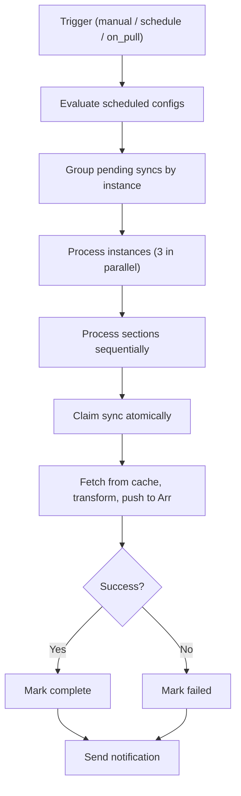
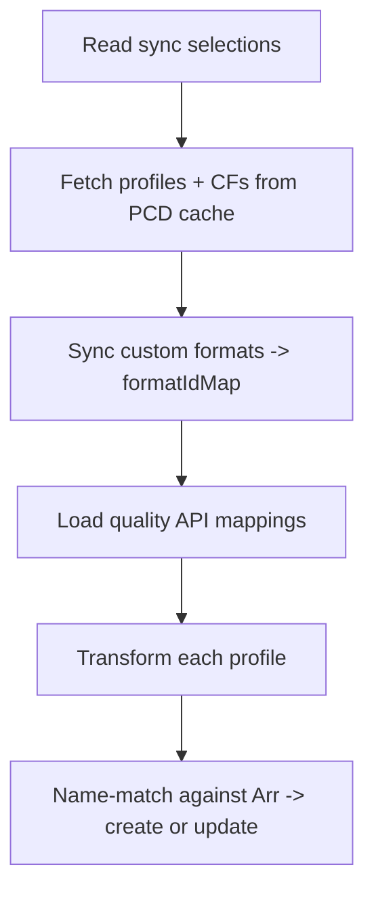

# Sync

**Source:** `src/lib/server/sync/` (processor, base, registry, mappings,
customFormats/, qualityProfiles/, delayProfiles/, mediaManagement/)

The sync system pushes compiled PCD configuration from the in-memory cache into
live Arr instances via their HTTP APIs. It reads entity state from the PCD cache
(see [pcd.md](./pcd.md)), transforms it into Arr API payloads, and creates or
updates resources by name. There is no diff tracking or rollback. Operations are
idempotent on retry because name-based matching converts would-be creates into
updates for items that already exist.

Arr instances are always active. Legacy disabled rows are migrated back to
enabled, and the settings UI no longer exposes an instance-level disable
control.

## Table of Contents

- [Pipeline](#pipeline)
  - [Triggers](#triggers)
  - [Processor Flow](#processor-flow)
  - [Status](#status)
- [Section Registry](#section-registry)
- [Database Priority](#database-priority)
  - [Schema](#schema)
  - [Lifecycle](#lifecycle)
  - [Sync Order](#sync-order)
  - [UI](#ui)
  - [Open Questions](#open-questions)
- [Transformation](#transformation)
  - [Custom Formats](#custom-formats)
  - [Quality Profiles](#quality-profiles)
  - [Delay Profiles](#delay-profiles)
  - [Media Management](#media-management)
- [Entity Sync](#entity-sync)
- [Cleanup](#cleanup)
  - [Config Cleanup](#config-cleanup)
  - [Entity Cleanup](#entity-cleanup)
- [Drift Detection](#drift-detection)
- [Impact Analysis](#impact-analysis)
- [Error Handling and Recovery](#error-handling-and-recovery)
- [Logging and Notifications](#logging-and-notifications)

## Pipeline

### Triggers

| Trigger    | Source                           | Entry point                   |
| ---------- | -------------------------------- | ----------------------------- |
| `manual`   | POST /api/v1/databases/{id}/sync | `syncInstance()` in processor |
| `schedule` | Cron expression per section      | `evaluateScheduledSyncs()`    |
| `on_pull`  | PCD git pull completes           | `triggerSyncs()`              |

Manual syncs process all configured sections regardless of the `should_sync`
flag. Schedule and on_pull mark individual sections as pending and enqueue
section-specific jobs. See [jobs.md](./jobs.md) for dispatch mechanics.

### Processor Flow



`CONCURRENCY_LIMIT = 3` caps parallel instance processing via
`processBatches()`. Sections run sequentially within an instance because quality
profiles depend on custom formats being synced first (profiles reference CF IDs
for scoring). `claimSync()` atomically transitions `sync_status` from `pending`
to `in_progress`, preventing double-processing if a job fires while the
previous run is still active.

### Status

| Status    | Meaning                               |
| --------- | ------------------------------------- |
| `success` | All sections completed without errors |
| `partial` | Some sections succeeded, some failed  |
| `failed`  | All sections failed                   |

## Section Registry

The registry (`registry.ts`) decouples the processor from section-specific
logic. Each section type implements a `SectionHandler` interface:

| Method                    | Purpose                                   |
| ------------------------- | ----------------------------------------- |
| `claimSync()`             | Atomic pending-to-in_progress transition  |
| `completeSync()`          | Mark section as synced, update timestamp  |
| `failSync()`              | Record error message                      |
| `setStatusPending()`      | Mark for next sync cycle                  |
| `getPendingInstanceIds()` | Query instances needing sync              |
| `getScheduledConfigs()`   | Return cron + nextRunAt for scheduling    |
| `createSyncer()`          | Factory for section-specific BaseSyncer   |
| `hasConfig()`             | Whether the instance has anything to sync |

Three handlers register themselves on import via `registerSection()`:

| Section           | Config scope                                                                                     |
| ----------------- | ------------------------------------------------------------------------------------------------ |
| `qualityProfiles` | Multi-profile selection from one or more databases (see [Database Priority](#database-priority)) |
| `delayProfiles`   | Single profile selection (or none)                                                               |
| `mediaManagement` | Three independent configs (naming, media settings, quality definitions)                          |

## Database Priority

Quality profile sync supports multiple databases per Arr instance. A priority
ordering determines which database's version of an entity wins when more than
one database manages the same name. Other sections (delay profiles, media
management) are unaffected because they are idempotent, single-config
selections where priority has no practical effect.

### Schema

A junction table stores the priority ordering per instance:

```sql
CREATE TABLE arr_sync_database_priority (
    instance_id INTEGER NOT NULL,
    database_id INTEGER NOT NULL,
    priority INTEGER NOT NULL,
    PRIMARY KEY (instance_id, database_id),
    FOREIGN KEY (instance_id) REFERENCES arr_instances(id) ON DELETE CASCADE,
    FOREIGN KEY (database_id) REFERENCES database_instances(id) ON DELETE CASCADE
);
```

Every (instance, database) pair has a row. Priority 1 is the highest priority.
The table is always fully populated: every Arr instance has a row for every
linked database.

### Lifecycle

Priority rows are created and removed automatically. The user never manually
adds or removes a database from the priority list.

| Event              | Action                                                           |
| ------------------ | ---------------------------------------------------------------- |
| Database linked    | Insert a row for every Arr instance, appended at lowest priority |
| Instance created   | Insert a row for every linked database, ordered by database ID   |
| Database unlinked  | FK cascade deletes all rows for that database                    |
| Instance deleted   | FK cascade deletes all rows for that instance                    |
| User reorders (UI) | Update priority values to reflect the new drag-and-drop ordering |

On migration, existing (instance, database) pairs are seeded using
`ROW_NUMBER() OVER (PARTITION BY instance_id ORDER BY database_id)` so every
instance gets a clean 1, 2, 3... sequence based on database creation order.

### Sync Order

The syncer groups quality profile selections by database, then iterates
databases in priority order from lowest to highest. The highest-priority
database syncs last, so its version of any shared entity overwrites earlier
versions via Arr's name-based matching.

For a setup with two databases (foo at priority 1, bar at priority 2):

1. Bar syncs first (lower priority). Its profiles and referenced CFs are
   pushed to Arr.
2. Foo syncs next (higher priority). Its profiles and referenced CFs are
   pushed, overwriting any names that bar already created.

The Arr API's name-based create-or-update behavior handles the overwriting
naturally. No merge logic or conflict resolution is needed.

CFs are pulled along with their profiles as they are today. If both databases
define a CF with the same name, the higher-priority database's version is the
one that persists after sync completes.

### UI

The sync page shows each database as a draggable card, ordered by priority.
Profile toggles are nested inside each database card. Users can select
profiles from multiple databases simultaneously. Drag-and-drop reordering
sets the priority, with the topmost card being highest priority.

### Open Questions

- **Drift with overlapping entities.** Drift currently compares per-database
  expected state against Arr. When a higher-priority database overwrites a
  lower-priority database's entity, the lower-priority database will report
  drift for that entity. This is technically accurate but not actionable. For
  now this is accepted as minor noise given that overlapping entities are
  expected to be rare (a handful of CFs, no profiles). Revisit if multi-database
  adoption makes the noise significant.

- **On-demand entity sync and hierarchy.** Entity sync takes an explicit
  (instanceId, databaseId, entityName) and pushes from that database
  regardless of priority. If a user edits an entity in a lower-priority
  database and pushes, it overwrites the higher-priority version until the
  next full sync restores it. This is accepted for now because the user
  explicitly chose to push that edit. Revisit if this causes confusion in
  practice.

## Transformation

The transformation layer converts PCD cache entities into Arr API payloads.
Each section has its own transformer. The system fetches the current Arr state,
matches by name, and creates or updates as needed.

### Custom Formats

**Source:** `customFormats/transformer.ts`

The CF transformer maps PCD conditions to Arr "specifications." Each condition
type maps to an Arr implementation class:

| PCD type           | Arr implementation             | Arr-type filter |
| ------------------ | ------------------------------ | --------------- |
| `release_title`    | `ReleaseTitleSpecification`    | all             |
| `release_group`    | `ReleaseGroupSpecification`    | all             |
| `edition`          | `EditionSpecification`         | all             |
| `source`           | `SourceSpecification`          | all             |
| `resolution`       | `ResolutionSpecification`      | all             |
| `indexer_flag`     | `IndexerFlagSpecification`     | all             |
| `quality_modifier` | `QualityModifierSpecification` | Radarr only     |
| `release_type`     | `ReleaseTypeSpecification`     | Sonarr only     |
| `size`             | `SizeSpecification`            | all             |
| `language`         | `LanguageSpecification`        | all             |
| `year`             | `YearSpecification`            | all             |

Key behaviors:

- Conditions whose `arrType` targets a different app are filtered out (e.g.
  `quality_modifier` conditions are dropped for Sonarr).
- Pattern-based conditions (`release_title`, `release_group`, `edition`) use the
  linked regular expression's `pattern` field as the specification value.
- Enum conditions (`source`, `resolution`, `indexer_flag`, etc.) resolve PCD
  string names to Arr integer IDs via `mappings.ts`. Radarr and Sonarr use
  different integer values for the same concept.
- `syncCustomFormats()` returns a `Map<name, arrId>` covering every CF on the
  instance (not just synced ones). Quality profiles need this because the Arr API
  requires every CF to appear in profile `formatItems`.

### Quality Profiles

**Source:** `qualityProfiles/transformer.ts`

QP sync has a hard dependency on custom formats: CFs must be synced first
because profiles reference CF IDs for scoring.



Transformation details:

- **Quality items**: PCD quality names map to Arr API names via the
  `quality_api_mappings` table. `mapQualityName()` handles naming differences
  between apps (Sonarr uses `Bluray-1080p Remux`, Radarr uses `Remux-1080p`).
- **Groups**: PCD group IDs are remapped to `1000 + index` (Arr convention).
  Members are nested inside their group. All unused qualities are appended as
  disabled entries.
- **Quality ordering**: Items are reversed to match the Arr's expected order
  (highest quality first in Arr API, last in PCD).
- **Scoring**: Explicit CF scores from the profile are resolved via
  `formatIdMap`. All remaining CFs on the instance are included with score 0
  (Arr validation requires the full set).
- **Language**: Radarr profiles include a language field. Sonarr always omits it
  (Sonarr uses custom formats for language filtering).
- **Upgrade fields**: `cutoffFormatScore`, `minFormatScore`, and
  `minUpgradeFormatScore` (minimum 1) map directly.

### Delay Profiles

**Source:** `delayProfiles/syncer.ts`

Single-profile sync that always overwrites the default Arr profile (id=1). The
PCD `preferred_protocol` enum maps to Arr fields:

| PCD value        | enableUsenet | enableTorrent | preferredProtocol |
| ---------------- | ------------ | ------------- | ----------------- |
| `prefer_usenet`  | true         | true          | usenet            |
| `prefer_torrent` | true         | true          | torrent           |
| `only_usenet`    | true         | false         | usenet            |
| `only_torrent`   | false        | true          | torrent           |

Hardcoded defaults: `order = 2147483647` (max int, default profile ordering),
`tags = []` (default profile cannot have tags).

### Media Management

**Source:** `mediaManagement/syncer.ts`, `handler.ts`

Three independent configs, each following a GET-merge-PUT pattern: fetch the
full Arr config, overwrite only PCD-managed fields, PUT it back.

| Config              | PCD tables                        | Arr endpoint            |
| ------------------- | --------------------------------- | ----------------------- |
| Media Settings      | radarr/sonarr_media_settings      | /config/mediamanagement |
| Naming              | radarr/sonarr_naming              | /config/naming          |
| Quality Definitions | radarr/sonarr_quality_definitions | /qualitydefinition      |

Naming fields differ by app: Radarr has movie format and folder format. Sonarr
adds standard/daily/anime episode formats, series folder, season folder, and
multi-episode style.

Quality definitions match PCD quality names to Arr API names via the same
mapping table, then update `minSize`, `maxSize`, and `preferredSize` per tier.
PCD stores 0 for "unlimited"; the transformer converts to null.

## Entity Sync

**Source:** `entitySync.ts`

Targeted single-entity sync executed inline (no job queue). Used when the UI
saves an entity and the user wants to push immediately. Supported types:
quality profiles, custom formats, regular expressions (cascading to all CFs
using the regex), delay profiles, naming, quality definitions, and media
settings.

Entity sync uses the same transform logic as batch sync but operates on a
single entity. For quality profiles, targeted sync first syncs the profile's
referenced CFs before creates and updates so newly scored formats have Arr IDs
before the profile payload is built.

## Cleanup

### Config Cleanup

**Source:** `cleanup.ts`

Scans an Arr instance for custom formats and quality profiles that exist on the
instance but are not referenced by current sync selections. The scan compares
the Arr's full list against the expected set derived from sync config.

Deletion order: CFs first, then QPs. Quality profiles assigned to media return
HTTP 500 from the Arr API and are skipped with a warning.

### Entity Cleanup

**Source:** `entityCleanup.ts`

Detects media removed from TMDB/TVDB by reading the Arr health API. Health
messages with source `RemovedMovieCheck` (Radarr) or `RemovedSeriesCheck`
(Sonarr) contain external IDs. The system extracts these IDs via regex, matches
them against the library, and offers scan/delete operations.

## Drift Detection

See [drift.md](./drift.md).

Drift detection checks whether Arr still matches what Profilarr would sync now.
It may reuse sync transformers to build expected state, but it does not sync,
repair, or cleanup.

Drift currently covers custom formats, quality profiles, and the default delay
profile. Media management coverage (naming, media settings, quality
definitions) is planned as a follow-up.

After a successful sync that touched Arr, the sync handler enqueues an
`arr.drift` job for the same instance so the drift status (and the per-section
progress chips on the sync page) reflect the new state without waiting for the
next scheduled drift run. Gated on `FEATURES.drift` and per-instance drift
settings.

## Impact Analysis

**Source:** `affectedArrs.ts`

Answers "which Arr instances would be affected by editing this entity?" The
dependency graph traverses: regex -> CFs using it -> QPs referencing those CFs
-> instances syncing those QPs. Used by the UI to show affected instances before
pushing changes. Supports all entity types.

## Error Handling and Recovery

- **Per-item isolation**: Each CF or QP push is wrapped in try/catch. A single
  failed item does not abort the section.
- **No rollback**: Operations are independent. A partially synced section leaves
  the instance in a valid (if incomplete) state. Retrying picks up where it left
  off because name-based matching converts creates to updates.
- **Startup recovery**: `recoverInterruptedSyncs()` resets any `in_progress`
  syncs back to `pending` so they retry on the next cycle. Called during server
  startup from `utils.ts`.
- **Atomic claim**: `claimSync()` prevents double-processing if the sync job
  fires while a previous run is still active.

## Logging and Notifications

Logging uses tagged sources per subsystem:

| Source                      | Scope                          |
| --------------------------- | ------------------------------ |
| `SyncProcessor`             | Instance grouping, scheduling  |
| `Syncer`                    | Base syncer lifecycle          |
| `Sync:QualityProfiles`      | QP create/update results       |
| `Sync:CustomFormats`        | CF create/update results       |
| `Sync:DelayProfile`         | Delay profile sync             |
| `Sync:MediaManagement`      | Media management umbrella      |
| `Sync:Naming`               | Naming config sync             |
| `Sync:MediaSettings`        | Media settings sync            |
| `Sync:QualityDefinitions`   | Quality definitions sync       |
| `EntitySync:*`              | Per-type entity sync           |
| `Cleanup` / `EntityCleanup` | Stale config and media cleanup |
| `SyncRecovery`              | Startup recovery               |

Sync notifications use the `arrSync()` definition from the
[notification system](./notifications.md). Three severities based on section
results:

| Type               | Severity | When                                 |
| ------------------ | -------- | ------------------------------------ |
| `arr.sync.success` | success  | All sections succeeded               |
| `arr.sync.partial` | warning  | Some sections succeeded, some failed |
| `arr.sync.failed`  | error    | All sections failed                  |

Each notification includes per-section summary lines with item counts and
actions (created/updated).
