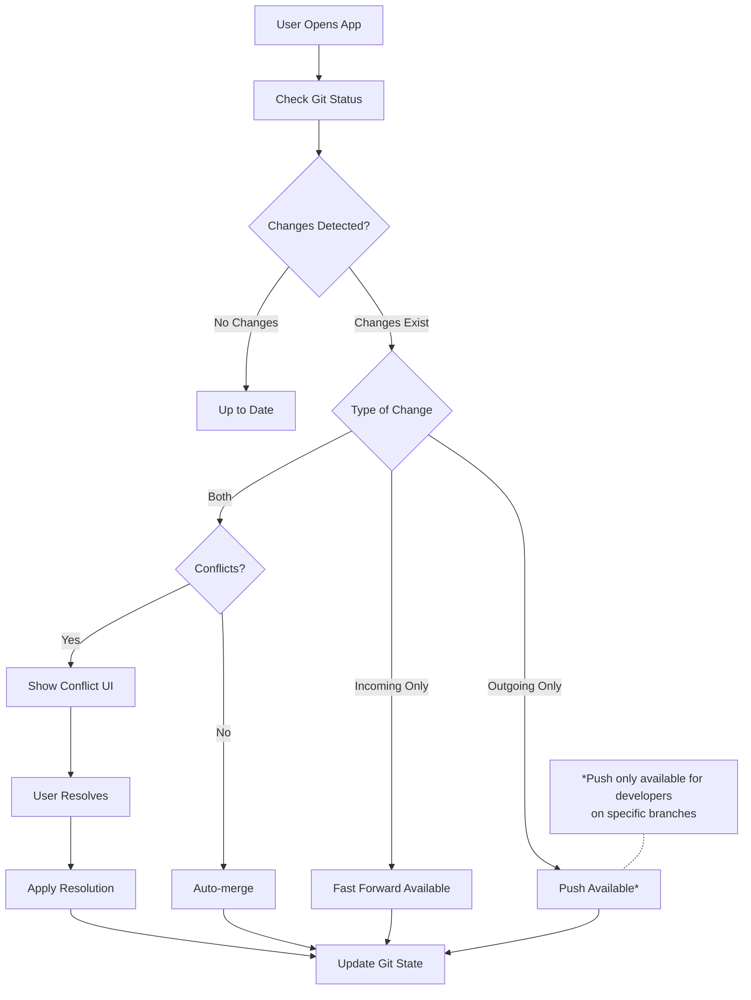

Profilarr Sync Flow

```mermaid
flowchart TD
    A[User Opens App] --> B[Check Git Status]
    B --> C{Changes Detected?}
    C -->|No Changes| D[Up to Date]
    C -->|Changes Exist| E{Type of Change}
    E -->|Incoming Only| F[Fast Forward Available]
    E -->|Outgoing Only| G[Push Available*]
    E -->|Both| H{Conflicts?}
    H -->|Yes| I[Show Conflict UI]
    H -->|No| J[Auto-merge]
    I --> K[User Resolves]
    K --> L[Apply Resolution]
    L --> M[Update Git State]
    J --> M
    F --> M
    G --> M

    %% Add note about push restrictions
    N[*Push only available for developers<br/>on specific branches]
    N -.- G
```
